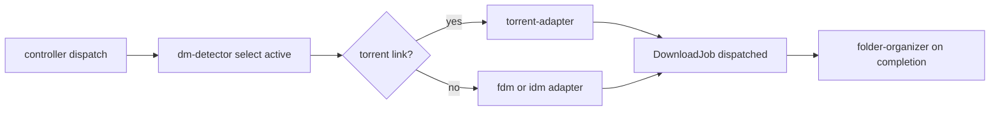

# Rule 07: Download Manager Integration

Downloads are handed to an **installed download manager** through a pluggable
**adapter layer**. lewdzone-launcher never downloads the file itself, never drives a
manager's UI, never guesses a binary path, and always hands the manager the
**resolved real URL** (never a `#fragment` go-link).

## Adapter contract

## Per-manager invocation

| Manager | Platform | Invocation |
| --- | --- | --- |
| FDM | Windows | `fdm.exe -fs "<url>"` |
| IDM | Windows | `IDMan.exe /d <url> /n /p <target_dir>` |
| uTorrent/BitTorrent | Windows/Linux/macOS | `<client> <magnet or .torrent>` |

Every adapter implements `name`, `platforms`, `handles_kind`,
`detect() -> Path|None`, `launch(url, target_dir, filename)`. Register in a
`MANAGERS` dict; dispatch is `MANAGERS[settings.active_manager]`.

## Hard rules

1. **Resolve first.** Never pass a `#fragment` go-link to any manager. Resolve
   via `api.php` (Rule 05) and strip the trailing literal `\r`.
2. **Silent always.** FDM `-fs`; IDM `/n`; torrent clients take the link as a
   positional argument. No interactive dialogs.
3. **Never `shell=True`.** Build argv as a list; URLs are data.
4. **Cross-platform spawn.** Windows `CREATE_NO_WINDOW`; POSIX
   `start_new_session=True`. `subprocess.Popen(..., shell=False)`.
5. **Detach.** Schedule async on the manager's side; never wait for the full
   download lifetime. Job row → `status=dispatched` before spawn.
6. **Tolerate absent managers.** A manager missing on the current platform is
   normal (FDM/IDM are Windows-only). Report what IS installed; exit code 4
   (Rule 12) with an actionable message, never a hang.
7. **Torrents route to torrent clients only.** `.torrent`/magnet never reach
   http adapters.
8. **Fold after completion** via folder-organizer:
   `<DownloadRoot>/Games/<Title>/<Title> - <Version> - <Platform>[- <Variant>].<ext>`;
   sanitize `\ / : * ? " < > |`; never overwrite (suffix ` (1)`, ` (2)`, ...).

## Errors

- **Manager missing** → error code 4 (`DM_MISSING`, see Rule 12) listing
  discovered alternatives.
- **Resolve failed/timeout** → do NOT hand any manager the token fragment;
  report the resolve error (code 3).
- **Spawn failed** → mark job `status=failed`; surface the OS error, not a
  crash.

## Testing

- Mock `fdm.exe` / `IDMan.exe` / torrent-client shims in `tests/support/`
  record argv; assert invocation shapes per adapter.
- Detection + spawn suites run on the platform seam (see `architect`) — the
  fake never talks to a real manager.
- Live smoke (opt-in, tagged `live`) may launch a real manager with a harmless
  URL; CI never does.

## Definition of done

- Adapter registry + per-manager argv shapes are unit-tested and pinned.
- Missing manager yields a typed error with an alternatives list, fast.
- The folder-folding and naming behavior is cross-platform-verified.