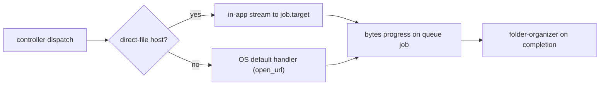

# Rule 07: Download Dispatch

Downloads are dispatched by **host class**, not by a pluggable download-manager
adapter. lewdzone-launcher streams **direct-file hosts** in-app with live byte
progress and hands every other **resolved real URL** to the OS default handler
(the installed cloud app for that service, or the browser). There is no
download-manager detection, no adapter layer, and nothing is ever handed a
`#fragment` go-link.

## Dispatch model

`DIRECT_STREAM_HOSTS` lists the hosts that return the file directly
(`fileknot`, `pixeldrain`, `mediafire`, `workupload`); every other allowlisted
host opens via the OS default handler (cloud app or browser).

## Hard rules

1. **Resolve first.** Never dispatch a `#fragment` go-link. Resolve via
   `api.php` (Rule 05) and strip the trailing literal `\r`.
2. **Direct-file hosts stream in-app.** GET the resolved URL and write to
   `job.target` in 512 KiB chunks with a 1 MiB `BufWriter`, reporting
   `(bytes_done, bytes_total)` into the queue job (Rule 11 seam for offline
   tests).
3. **Redirects stay same-owner.** A stream redirect must remain on the same
   host or a dot-boundary subdomain; a cross-domain detour is refused
   (`Error::Network`). Max 3 redirect hops.
4. **Everything else opens via the OS default handler.** `core::native::open_url`
   uses `rundll32 url.dll,FileProtocolHandler` (Windows), `open` (macOS),
   `xdg-open` (Linux) with no shell and no window.
5. **Never spawn a download manager.** No adapter registry, no `active_manager`
   setting, no per-manager CLI flags. Delete stale manager references.
6. **No body-read timeouts on streams.** The download agent may set connect and
   response-header timeouts but must not impose a per-body-read budget that
   would abort a multi-GB stream. `max_redirects(0)` + manual hop validation.
7. **Fold after completion** via folder-organizer:
   `<DownloadRoot>/Games/<Title>/<Title> - <Version> - <Platform>[- <Variant>].<ext>`;
   sanitize `\ / : * ? " < > |`; never overwrite (suffix ` (1)`, ` (2)`, ...).

## Errors

- **Redirect refused** → error code 3 (`NETWORK`, Rule 12) with the refused
  target; the file is never partially written from a foreign host.
- **Resolve failed/timeout** → do NOT dispatch the token fragment; report the
  resolve error (code 3).
- **Stream failed** → mark the job `status=failed`; surface the OS error, not a
  crash.

## Testing

- The stream seam takes `(url) -> (total_bytes, Box<dyn Read>)` (see
  `download::StreamFn`); tests inject a stub reader and assert
  `bytes_done`/`bytes_total` propagate into the queue job.
- Redirect helpers (`origin_of`, `redirect_target`, `download_stream`) have
  unit tests pinning same-owner acceptance and cross-domain refusal.
- Live smoke (opt-in, tagged `#[ignore]`) may stream a harmless direct file;
  CI never does.

## Definition of done

- Direct-file hosts stream in-app with byte progress; all other hosts open via
  the OS default handler — both paths unit-tested and pinned.
- Cross-domain redirect detours are refused with a typed error, fast.
- The folder-folding and naming behavior is cross-platform-verified.
- No download-manager references remain in code, settings, or docs.