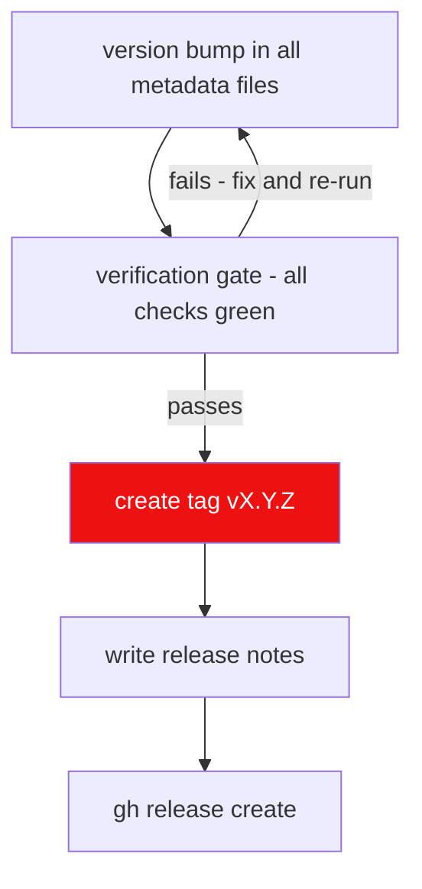

# Rule 08: Release Standards

Adapted from `HELIX-Discord-Bot` Rule 08. Every release is
SemVer-versioned, fully verified, tagged, and published through GitHub CLI
with structured release notes.

## Versioning: SemVer `MAJOR.MINOR.PATCH`

| Segment | Bump when | Examples |
| --- | --- | --- |
| MAJOR | breaking API/CLI/DB contract changes | `2.0.0` |
| MINOR | new compatible features | `2.3.0` |
| PATCH | compatible bug fixes | `2.3.1` |

## Release flow



## Mandatory steps

1. **Version sync.** `MAJOR.MINOR.PATCH` must be identical across every
   metadata file before the tag: `pyproject.toml`, `lewdzone_launcher/__init__.py`
   `__version__`, `docs/` copy, requirements lockfiles (if pinned to version).
2. **Verification gate before tag/commit/publish.**
   - `pytest -q` green (offline suite)
   - ruff clean
   - pyright strict clean
   - coverage ≥ floors (Rule 11)
   - bandit + pip-audit clean (Rule 10)
   - CLI smoke: `lewdzone --version` prints the new version
3. **Tag format:** `vX.Y.Z` (e.g. `v1.4.2`), annotated, on the merge commit
   of the release branch.
4. **Release title:** `vX.Y.Z — <Key Feature>`
   (e.g. `v1.4.2 — catalog sync + DM queue`).
5. **Release notes structure** (emoji section headers):

   | Section | Content |
   | --- | --- |
   | `✨ Highlights` | headline changes for users |
   | `🚀 Key Improvements & Features` | bulleted new/changed capabilities |
   | `🛡️ Security & Governance` | security fixes, dependency bumps |
   | `📄 Changes & Commits` | link to commit range + notable commits |
   | `📦 Quick Start & Upgrading` | one-liner install + upgrade snippet |
   | `📜 Changelog` | link to the matching `CHANGELOG.md` release entry |

   Every release MUST also add a `CHANGELOG.md` entry under a `## [vX.Y.Z](<release-url>)`
   header (custom format, see the [changelog template](../templates/changelog.md)).
   Historical record: every change is listed there, newest releases on top. The
   release notes and the changelog entry are authored from the same commit list.

6. **Publish via GitHub CLI, non-interactive, body from file:**
   ```bash
   gh release create vX.Y.Z \
     --title "vX.Y.Z — <Key Feature>" \
     --notes-file release-notes.md
   ```
7. **Post-release:** update the roadmap issue (Rule 04) to reflect the shipped
   sub-issues; mark `Verification & Docs Sync` complete.

## Pre-release (alpha/beta)

- Apply a pre-release suffix: `v2.0.0-alpha.1`, `v2.0.0-beta.2`.
- Use `--prerelease` flag on `gh release create`.
- Gate is identical; only the tag and flag differ.

## Failure modes

- Tag created without the verification gate passing → release is void; fix
  forward, do not delete/re-push tags.
- Version mismatch between metadata files → CI must fail.
- Release notes referencing an unmerged sub-issue → block.