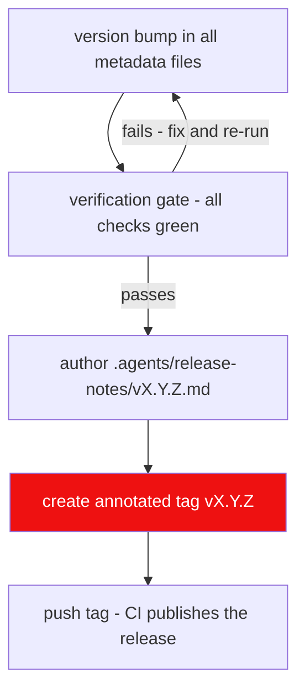

# Rule 08: Release Standards

Adapted from `HELIX-Discord-Bot` Rule 08. Every release is
SemVer-versioned, fully verified, tagged, and published through GitHub CLI
with structured release notes.

## Versioning: SemVer `MAJOR.MINOR.PATCH`

| Segment | Bump when | Examples |
| --- | --- | --- |
| MAJOR | breaking API/CLI/DB contract changes | `2.0.0` |
| MINOR | new compatible features | `2.3.0` |
| PATCH | compatible bug fixes | `2.3.1` |

## Release flow

## Mandatory steps

1. **Version sync.** `MAJOR.MINOR.PATCH` must be identical across every
   metadata file before the tag: `src-tauri/Cargo.toml`,
   `src-tauri/tauri.conf.json`, root `package.json`.
2. **Verification gate before tag/commit/publish.**
   - `cargo test` green (offline suite) + `cargo clippy -- -D warnings`
   - `cargo fmt --check` clean
   - `npm run check` (svelte-check) + `npm run test` (Vitest) clean
   - coverage ≥ floors (Rule 11)
   - `cargo audit` + `cargo deny` clean (Rule 10)
   - CLI smoke: `lewdzone --version` prints the new version
3. **Tag format:** `vX.Y.Z` (e.g. `v1.4.2`), annotated, on the merge commit
   of the release branch.
4. **Release title:** `LewdZone Launcher vX.Y.Z` (e.g. `LewdZone Launcher
   v1.4.2`). The workflow hardcodes this as the release name, so it is the
   enforced format — do not hand-edit the title after CI publishes.
5. **Release notes structure** (emoji section headers, in this exact order):

   | Section | Content |
   | --- | --- |
   | `# LewdZone Launcher vX.Y.Z` | H1 title line — keep it, the body repeats the release name |
   | `**Release date:**` | `YYYY-MM-DD` |
   | `✨ Highlights` | 2–3 sentence summary for users |
   | `🚀 Key Improvements & Features` | bulleted new/changed capabilities |
   | `🐛 Fixed` | bulleted bug fixes |
   | `✅ Changed` | behavioral or metadata changes |
   | `📦 Install & Upgrading` | per-platform installer names + in-place upgrade note |
   | `Verification` | the gate commands and their results |
   | `📄 Changes & Commits` | notable commits, then `Full commit history: git log --oneline <prev>..vX.Y.Z` |

   These headings and their order are the house style — match the previous
   release rather than inventing new sections. Every release MUST also add a
   `CHANGELOG.md` entry under a `## [vX.Y.Z](<release-url>)` header (custom
   format, see the [changelog template](../templates/changelog.md)).
   Historical record: every change is listed there, newest releases on top. The
   release notes and the changelog entry are authored from the same commit list.

6. **Publish by pushing the annotated tag.** The `.github/workflows/package.yml`
   CI workflow triggers on every `v*` tag push, builds the unified installer on
   all three platforms (`npm run build:installer`), and creates/publishes the
   GitHub Release with attached artifacts. Release notes come from
   `scripts/extract-release-notes.mjs`, which prefers the hand-authored
   `.agents/release-notes/vX.Y.Z.md` and only falls back to parsing
   `CHANGELOG.md`. Author the notes file before tagging. Do not run
   `gh release create` manually.
7. **Post-release:** update the release body if needed (e.g. to use the
    hand-authored notes file in `.agents/release-notes/vX.Y.Z.md`), update the
    roadmap issue (Rule 04) to reflect the shipped sub-issues, and mark
    `Verification & Docs Sync` complete.

## Pre-release (alpha/beta)

- Apply a pre-release suffix: `v2.0.0-alpha.1`, `v2.0.0-beta.2`.
- Use `--prerelease` flag on `gh release create`.
- Gate is identical; only the tag and flag differ.

## Failure modes

- Tag created without the verification gate passing → release is void; fix
  forward, do not delete/re-push tags.
- Version mismatch between metadata files → CI must fail.
- Release notes referencing an unmerged sub-issue → block.