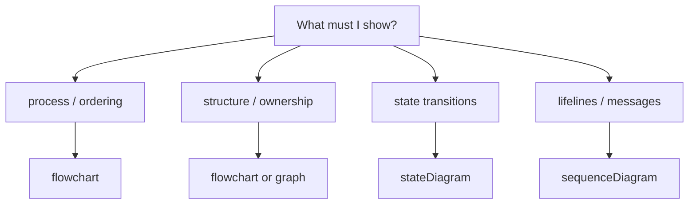

# Rule 09: Mermaid Standards

GitHub renders Mermaid v10.x (verify via an ```` info` block if unsure). Every
diagram in this ecosystem — agents, skills, rules, templates, READMEs, issues,
release notes — MUST render correctly on GitHub. This rule is non-negotiable;
an unreadable diagram fails review.

## Mandatory rules

1. **Fence correctly:** ````` ```mermaid ```` ```` (exact spelling).
2. **Flowchart default:** `flowchart TD` unless a wide-shallow pipeline argues
   for `LR`.
3. **Quote every label containing special chars** `( ) [ ] : # | " ` / < > & =`
   — node labels quote the whole label, edge labels quote the edge label:
   - `CMD["header"]` ✅   `CMD[header]` ❌
   - `A -->|"Yes"| B` ✅   `A -->|Yes| B` ❌
4. **Subgraph titles MUST be quoted** — unquoted subgraph titles silently
   break the diagram:
   - `subgraph UI["UI thread - main loop"]` ✅
   - `subgraph UI[UI thread - main loop]` ❌
   - `subgraph UI["..."]` NEVER `subgraph UI[...]`
5. **One concern per diagram** — one diagram === one idea. Never cram.
6. **Node budget:** ≤8–12 nodes per diagram. Larger flows split into two
   diagrams connected by reference.
7. **Short labels.** If a label needs a sentence, split the diagram.
8. **Label every decision branch** on both outcomes.
9. **No reset/frontmatter directives:** no `%%{init}%%`, no `%%{config}%%`,
   no `config:` blocks.
10. **No math/LaTeX** (`$...$`, `$$\n...\n$$`).
11. **Avoid exotic shapes:** no trapezoid `[/x/]`, no `{{...}}` hexagons,
    no `/` shapes. Circles, rounded rects, and regular rects only.
12. **Avoid reserved-word IDs:** `end`, `class`, `note`, `subgraph`, `link`,
    `default`, `linkStyle`. Prefix IDs with the diagram's role, e.g.
    `S[argo, cmd, gd, res, db…]`.
13. **Styling:** only `classDef`, `linkStyle`, and `style` color overrides are
    supported. No `fill:...` inside node declarations.
14. **`<br/>` inside labels:** use multi-line labels surrounded by quotes:
    `CMD["line one<br/>line two"]` — the angle brackets require quoting.

## Diagram choice guide



## Self-check before committing

- [ ] fenced exactly ````` ```mermaid ```` ````
- [ ] every label with special chars quoted
- [ ] every subgraph title quoted (`subgraph id["Title"]`)
- [ ] ≤12 nodes, one concern per diagram
- [ ] no `%%{init}%%`, no math, no exotic shapes
- [ ] no reserved-word IDs
- [ ] edge labels on both branches of every decision