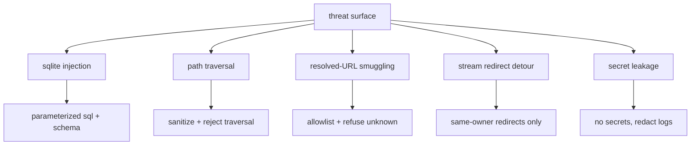

# Rule 10: Security & Secrets

The threat model is explicit (see
[security-auditor](../agents/review/security-auditor/security-auditor.md)).
Every resolved URL, every path, every spawned process is a trust boundary.

## Hard rules

1. **No secrets in the repo.** Never commit SteamGridDB API keys, tokens, or
   `.env` files. Keys load from `~/.config/lewdzone/` or env at runtime.
2. **Resolved-URL allowlist.** Only hosts present in the go.js `ICONS` list
   (or a re-verified allowlist) may be dispatched — either streamed in-app or
   handed to the OS default handler. Anything unknown → refuse and log
   (Rule 07).
3. **Parameterized SQL always.** No string-concatenated SQL (Rule 06).
4. **`std::process::Command` argv arrays** always; no user input interpolated
   into a shell string. For `open_url` use the platform-native opener without
   a shell: Windows `rundll32 url.dll,FileProtocolHandler`
   (`CREATE_NO_WINDOW`); POSIX `open` / `xdg-open` detached.
5. **Paths are user-relative, sanitized.** Download root is configurable but
   resolved against the user's home; game folder names sanitize
   `: * ? " < > |` (Rule 02) before join; reject traversal (`..`).
6. **Do not follow unknown redirects.** An in-app stream may follow a redirect
   only to the same host or a dot-boundary subdomain, max 3 hops; a cross-host
   detour aborts the stream (Rule 07). The scraper sees `lewdzone.com` +
   `www.steamgriddb.com`.
7. **No secrets in logs** (Rule 12 redaction).
8. **Dependency hygiene:** `cargo audit` and `cargo deny` run in the review
   gate.

## Threat checklist (per build task)

## Audit commands

- `cargo audit` (known-vulnerability scan of the dependency tree)
- `cargo deny check` (licenses + advisories + bans)

## Acceptable-risk callouts

- The Tauri webview serves only bundled Svelte code; no remote content is
  loaded into it.
- Shortcut creation uses the platform-native mechanism: the native Windows API
  for `.lnk` files in the user's own Start Menu/Desktop folders; `.desktop`
  files on Linux; `.app`/alias on macOS.