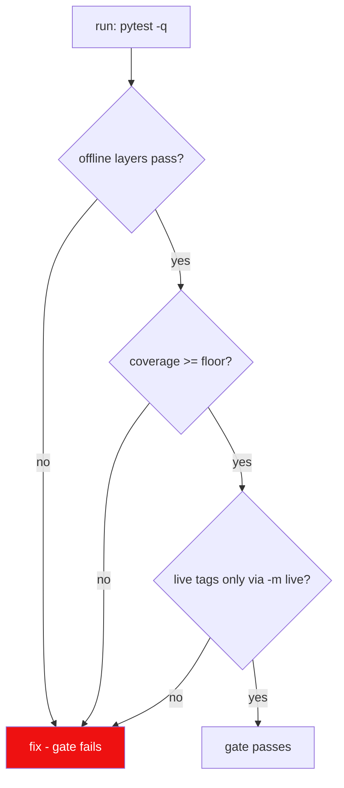

# Rule 11: Testing

The suite is a **vitest-style layered python suite** (see
[test-suite-architect](../agents/testing/test-suite-architect/test-suite-architect.md)) —
offline by default, fast, deterministic, and enforced to coverage floors.

## Layers

| Layer | Marker | Network? | Default in `pytest -q`? |
| --- | --- | --- | --- |
| unit | `unit` | no | yes |
| integration | `integration` | no (fixtures/fakes) | yes |
| live | `live` | yes (opt-in) | **no** — `-m live` |
| gui | `gui` | no | headless-safe smoke |
| windows | `windows` | no | skip when not win32 |

## Offline-first

- No test touches lewdzone.com, `api.php`, SteamGridDB, or FDM.
- Fakes live in `tests/support/`: transport shim, `fdm.exe` argv recorder,
  SteamGridDB client fake, `WScript.Shell` fake, `root.after` clock
  ([mock-engineer](../agents/testing/mock-engineer/mock-engineer.md)).
- HTML fixtures committed in `tests/fixtures/html/` from the reference
  captures (treasure-of-nadia page with 47 go-links; archive page).

## Coverage floors

| Target | Floor |
| --- | --- |
| overall (`--cov-fail-under`) | 85% |
| core (domain/services/controllers) | ~90% |
| gui | ~70% |
| report | `coverage.xml + junitxml` |

## Authoring

- One test file mirrors one module (`tests/unit/` mirrors module tree).
- Given/When/Then in test names: `test_parse_returns_version_when_marker_present`.
- Fixtures via pytest `conftest.py`, never module-level mutation.
- Golden files for parser outputs (snapshots) in `tests/fixtures/golden/`.
- Benchmarks in `tests/perf/` (micro-bench, see
  [perf-auditor](../agents/review/perf-auditor/perf-auditor.md)).

## Probe/script promotion (reuse, don't remake)

The pytest suite is the **sole home for every script in this repo** —
scanning, probing, verification, debugging, and one-off exploratory logic all
live as pytest modules inside `tests/`:

- Offline/offline-fixture logic → `tests/unit/` or `tests/integration/`.
- Real-network probes (pagination, API shapes, page structure) →
  `tests/live/` with the `live` marker, so they run opt-in via `-m live` and
  stay reusable without re-typing them each session.
- Benchmarks → `tests/perf/`.
- `scratch/` holds **no scripts at all**. Anything that needs a script is
  promoted into the suite; any `scratch/*.py` is **flagged by
  `tests/unit/scanners/test_scratch_promotion.py`** and fails the gate until
  the logic is moved into `tests/` and the scratch file deleted.
- Empirical findings (like the `/games/page/N/` pagination proof) are
  documented in the ROADMAP **and** pinned as live tests so they never
  silently regress or get re-discovered from scratch.

## Verification

- `pytest -q` (offline layers + coverage) — the gate.
- `pytest -m live` — on demand against the real site/API.
- `pytest --lf --ff` — re-run failures first during development.
- Coverage cliff PRs blocked.