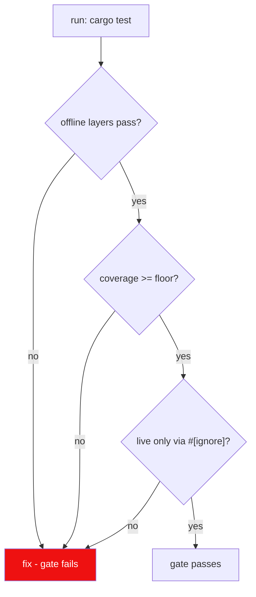

# Rule 11: Testing

The suite is a **layered set of Rust tests** (see
[test-suite-architect](../agents/testing/test-suite-architect/test-suite-architect.md)) —
offline by default, fast, deterministic, and enforced to coverage floors. The
Svelte frontend is covered by Vitest unit tests in `src/`.

## Layers

| Layer | Where | Network? | Default in `cargo test`? |
| --- | --- | --- | --- |
| unit | inline `#[cfg(test)]` modules in `src-tauri/src/` | no | yes |
| integration | `src-tauri/tests/integration/` | no (fixtures/fakes) | yes |
| live | `src-tauri/tests/live/` | yes (opt-in) | **no** — `#[ignore]` |
| gui/frontend | `src/` Vitest suites | no | `npm run test` |
| windows | `#[cfg(windows)]` + CI runners | no | skipped off-Windows |

## Offline-first

- No test touches lewdzone.com, `api.php`, SteamGridDB, or FDM.
- Fakes live in `src-tauri/tests/support/`: transport shim, `fdm.exe` argv
  recorder, SteamGridDB client fake, shortcut fake
  ([mock-engineer](../agents/testing/mock-engineer/mock-engineer.md)).
- HTML/JSON fixtures committed in `src-tauri/tests/fixtures/` from the
  reference captures (treasure-of-nadia page with 47 go-links; archive page).

## Coverage floors

| Target | Floor |
| --- | --- |
| overall (`cargo llvm-cov`) | 85% |
| core (domain/services/controllers) | ~90% |
| gui (Vitest coverage) | ~70% |
| report | lcov/cobertura + junit |

## Authoring

- One test module mirrors one source module (inline tests live next to code).
- Given/When/Then in test names:
  `parse_returns_version_when_marker_present`.
- Test helpers live in `src-tauri/tests/support/`; fakes are injected, never
  global state.
- Golden files for parser outputs (snapshots) in
  `src-tauri/tests/fixtures/golden/`.
- Benchmarks in `src-tauri/tests/perf/` (criterion, see
  [perf-auditor](../agents/review/perf-auditor/perf-auditor.md)).

## Probe/script promotion (reuse, don't remake)

The Rust test suite is the **sole home for every script in this repo** —
scanning, probing, verification, debugging, and one-off exploratory logic all
live as tests:

- Offline/offline-fixture logic → `src-tauri/tests/` (inline `#[cfg(test)]` or
  integration).
- Real-network probes (pagination, API shapes, page structure) →
  `src-tauri/tests/live/` tagged `#[ignore]`, so they run opt-in via
  `cargo test -- --ignored` and stay reusable without re-typing each session.
- Benchmarks → `src-tauri/tests/perf/`.
- `scratch/` holds **no scripts at all**. Anything that needs a script is
  promoted into the suite; stray logic in `scratch/` is flagged by a scanner
  test and fails the gate until the logic is moved into `src-tauri/tests/` and the
  scratch file deleted.
- Empirical findings (like the `/games/page/N/` pagination proof) are
  documented in the ROADMAP **and** pinned as live tests so they never
  silently regress or get re-discovered from scratch.

## Verification

- `cargo test` (from `src-tauri/`): offline layers + coverage — the gate.
- `cargo test -- --ignored`: live tests against the real site/API.
- `npm run test` (Vitest, from repo root): Svelte unit suites.
- Coverage-cliff PRs blocked.