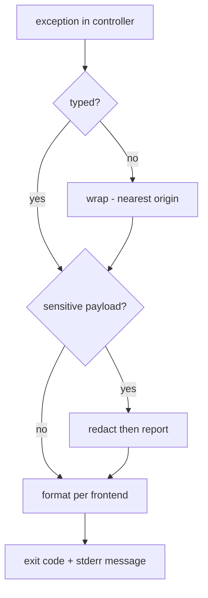

# Rule 12: Error Handling & Logging

Failures are structured, typed, and distinguishable. The CLI+GUI twin obeys one
error contract so parity holds (Rule 03, Rule 13).

## Exit code contract (CLI)

| Code | Meaning |
| --- | --- |
| `0` | success |
| `1` | runtime error |
| `2` | usage error |
| `3` | network error |
| `4` | download manager missing / not found |
| `5` | interrupted (Ctrl+C / user cancel) |

## Typed exceptions

Domain exceptions subclass a base `LewdzoneError` with a stable `code`.

```python
class LewdzoneError(Exception): ...      # base, code attr
class NetworkError(LewdzoneError): ...   # code=3
class DmMissingError(LewdzoneError): ... # code=4
class UsageError(LewdzoneError): ...     # code=2
```

- Controllers raise domain errors; frontends translate to display + exit code.
- Resolver wraps api.php failures into `NetworkError` with `retry_in` kept on
  the exception.

## stdout vs stderr

- **stdout**: machine output only (tables, `--json` payloads).
- **stderr**: progress, warnings, errors, chatty logs.
- `--json` output must remain parseable even when errors occur → errors always
  on stderr, exit code non-zero (Rule via [output-formatter](../agents/cli/output-formatter/output-formatter.md)).



## Logging

- `logging` stdlib, logger per module (`lewdzone_launcher.<pkg>`).
- Default level `INFO` for CLI chatter; `--verbose` → `DEBUG`.
- **Redaction:** never log tokens, SteamGridDB keys, or cookie secrets
  (Rule 10). A redact filter runs on every handler.
- GUI logs to a rotating file under the config dir; errors surface in the queue
  panel (Rule 13), not stderr-only.

## Never

- Bare `except:` / `except Exception:` without locating intent.
- Swallowing resolve errors to keep a download "queued".
- Printing tracebacks to stdout in `--json` mode.