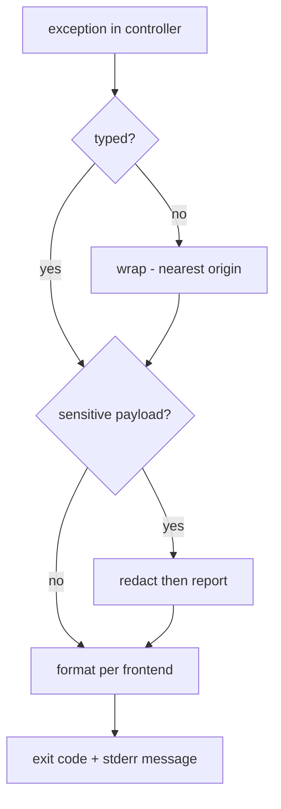

# Rule 12: Error Handling & Logging

Failures are structured, typed, and distinguishable. The CLI+GUI twin obeys one
error contract so parity holds (Rule 03, Rule 13).

## Exit code contract (CLI)

| Code | Meaning |
| --- | --- |
| `0` | success |
| `1` | runtime error |
| `2` | usage error |
| `3` | network error |
| `4` | *(unused — was the download-manager-missing code)* |
| `5` | interrupted (Ctrl+C / user cancel) |

## Typed errors

Domain errors are a typed enum `LewdzoneError` carrying a stable exit code:

```rust
pub enum LewdzoneError {                 // exposes a stable exit code
    Runtime(String),                     // code 1
    Usage(String),                       // code 2
    Network { retry_in: u64 },           // code 3
    Interrupted,                         // code 5
}
```

- Controllers return typed errors; frontends translate to display + exit code.
- Resolver wraps api.php failures into `Network` variants, keeping `retry_in`
  on the error.

## stdout vs stderr

- **stdout**: machine output only (tables, `--json` payloads).
- **stderr**: progress, warnings, errors, chatty logs.
- `--json` output must remain parseable even when errors occur → errors always
  on stderr, exit code non-zero (Rule via [output-formatter](../agents/cli/output-formatter/output-formatter.md)).



## Logging

- `tracing`/`log` facade, span or target per module
  (`lewdzone_launcher_lib::<mod>`).
- Default level `INFO` for CLI chatter; `--verbose` → `DEBUG`.
- **Redaction:** never log tokens, SteamGridDB keys, or cookie secrets
  (Rule 10). A redact filter runs on every handler.
- GUI logs to a rotating file under the config dir; errors surface in the queue
  panel (Rule 13), not stderr-only.

## Never

- Unwrapping/panicking in library code (only top-level entry points may).
- Swallowing resolve errors (`.ok()` with no handling) to keep a download
  "queued".
- Printing tracebacks to stdout in `--json` mode.

## Exit code gap at 4

`4` was the download-manager-missing code. The manager layer is removed, and
the gap is kept intentionally so existing scripts that read `$?` keep
distinguishing "no such exit" from the codes above/below it. No new error may
reuse `4`.