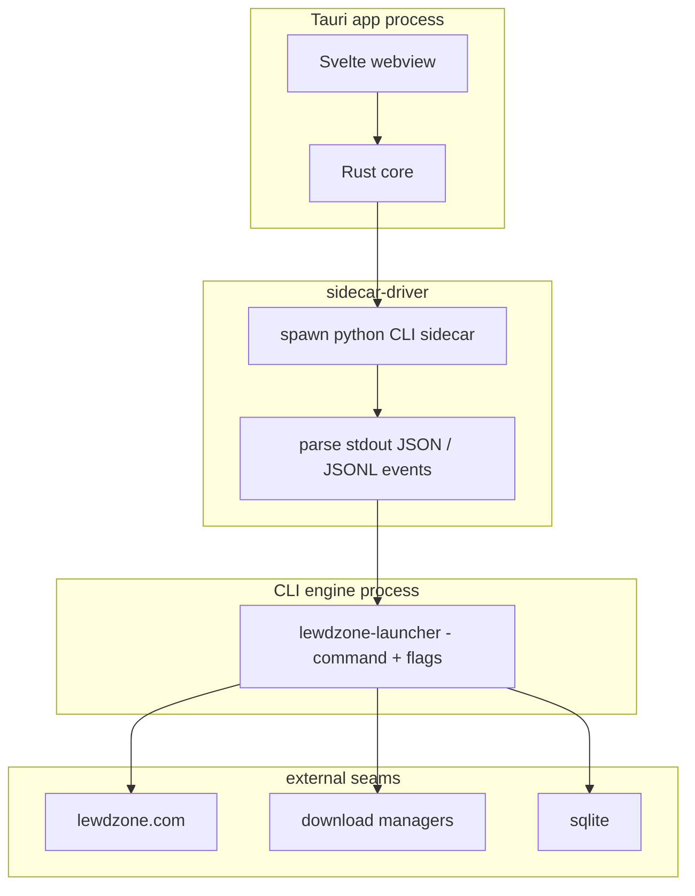

# Rule 13: GUI Conventions

The GUI is a **Tauri 2 desktop app** — the primary product. It never imports
the Python package and never touches the site, download managers, SQLite, or
SteamGridDB directly. Every workflow goes through the **CLI engine as a
subprocess** (Rule 03 parity), parsing machine JSON/JSONL output.

## Process model (two processes)

- **Webview + Rust core** runs in the app process.
- **Python CLI ships as a PyInstaller sidecar executable** (`externalBin`); the
  app spawns it as a subprocess and speaks JSON over stdout.
- **Query commands:** one `lewdzone-launcher <cmd> --json` invocation → one
  JSON document parsed, process reaped.
- **Long-running commands** (sync / download / shortcuts): machine mode streams
  JSONL events `{event, progress, message, ...}` with a final `result`; the UI
  renders progress and can cancel.
- **stdout is the protocol channel, stderr is diagnostics** — never parse
  stderr as data.
- **Spawn safety:** hidden console on Windows (`CREATE_NO_WINDOW`), detached
  session on POSIX; never `shell=True` (see
  [sidecar-driver](../agents/gui/sidecar-driver/sidecar-driver.md)).

## App/CLI parity

1. Every GUI action maps 1:1 to a CLI command (`lewdzone-launcher <cmd>`).
2. The app's bridge is generated/verified against the CLI's command tree; a
   drift is a bug, not a feature.
3. `lewdzone-launcher <cmd> --json` works headless with no app installed.
4. A GUI path that bypasses the CLI (or a CLI parser that hides domain logic)
   fails review (Rule 00 + Rule 03).

## View conventions

- **Pages:** Store (search + browse + download, Steam-style grid), Library
  (installed games: icon, cover, description, launch/shortcuts/uninstall),
  Downloads (queue), Settings.
- **Content comes live from the site** via the scrape pipeline — never
  hardcoded fixtures in the UI.
- **States:** each view has exactly loading / ready / error; no domain state
  survives navigation; virtualized lists; keyboard-first navigation.
- **Art:** cover-art-first tiles, equal aspect ratio; cached via the artwork
  pipeline (offline tolerant). See
  [view-designer](../agents/gui/view-designer/view-designer.md).

## Freeze checklist (per view feature)

- [ ] does the work via a CLI subprocess, never a Python import
- [ ] UI thread never blocks; long ops stream progress and are cancelable
- [ ] machine output parsed strictly (JSON/JSONL by command class)
- [ ] app version == sidecar CLI version (Rule 08)
- [ ] parity test covers the new command's bridge 1:1