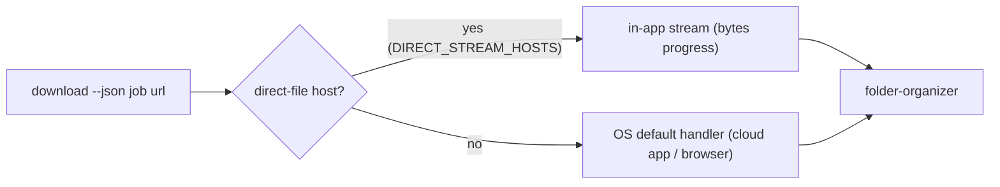

# Launch Download (Stream or Open)

Act on a **resolved** download URL by host class: direct-file hosts stream
in-app with live byte progress into the canonical folder tree; every other host
opens via the OS default handler (installed cloud app or browser). The tool no
longer drives download managers (see
[dm family](../agents/dm/dm.md)).

## Preconditions

- The URL is already **resolved** (start→reveal done, trailing literal `\r`
  stripped) — this skill never resolves tokens.
- The target host passes the allowlist; otherwise refuse (Rule 10).

## Dispatch flow

## Steps

1. **Validate the URL**: only a resolved, allowlisted URL — never a
   `#fragment` go-link (Rule 07 hard rule 1).
2. **Classify the host**: `DIRECT_STREAM_HOSTS` (`fileknot`, `pixeldrain`,
   `mediafire`, `workupload`) → stream; everything else → OS default handler.
3. **Stream in-app** (`core::download::stream_target` or
   `stream_target_accelerated`):
   - GET via the download agent (`max_redirects(0)`, no body-read timeout).
   - Follow redirects manually ≤3 hops; each must stay same-owner (host or
      dot-boundary subdomain) or the stream is refused (Rule 10).
   - Write 512 KiB chunks to `job.target`; report `(bytes_done, bytes_total)`
      into the queue job.
   - For supported archives (`.zip`, `.7z`, `.rar`, `.tar.*`, SFX `.exe`),
      extract into `job.install_dir` and remove the archive on success.
4. **Otherwise open** (`core::native::open_url`): platform opener via argv
   array, no shell — `rundll32 url.dll,FileProtocolHandler` (Windows),
   `open` (macOS), `xdg-open` (Linux).
5. **Record the job**: `status=downloading`→`extracting`→`completed` (or
   `dispatched` for OS-handler jobs); on failure mark `failed`; on user cancel
   mark `cancelled` and map the error.
6. **On completion**, run
   [folder-organizer](../agents/dm/folder-organizer/folder-organizer.md):
   fold into `<DownloadRoot>/Games/<Title>/<Title> - <Version> - <Platform>[-
   <Variant>].<ext>`; never overwrite (suffix `(N)`); sanitize `\ : * ? " <
   > |`.

## Checkoff

- [ ] URL resolved, allowlisted, `\r` stripped
- [ ] host classified (direct-file vs OS-handler)
- [ ] stream: same-owner redirects only, ≤3 hops, byte progress reported
- [ ] open_url via argv array only, no shell, no interpolation
- [ ] job row `downloading`/`dispatched` or `failed`
- [ ] completion folded + never overwrite