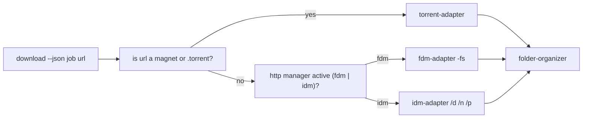

# Launch Download via Download Manager

Send a **resolved** download to the active manager silently and organize the
finished file into the canonical folder tree. The tool NEVER downloads itself —
it hands the real URL to an installed manager (see
[dm family](../agents/dm/dm.md)).

## Preconditions

- The URL is already **resolved** (start→reveal done, trailing literal `\r`
  stripped) — this skill never resolves tokens.
- The target host passes the allowlist; otherwise refuse (Rule 10).
- A manager is detected; if none, fail fast with exit code 4 and list the
  available managers (Rule 07).

## Dispatch flow

## Steps

1. **Validate the URL**: only a resolved, allowlisted URL — never a
   `#fragment` go-link (Rule 07 hard rule 1).
2. **Pick adapter** from `MANAGERS[settings.active_manager]`; torrent-only URLs
   route exclusively to the torrent-adapter.
3. **Record the job** row (`status=dispatched`) before spawning.
4. **Spawn silently and detach**:
   - Windows: `CREATE_NO_WINDOW`.
   - POSIX: detached session.
   - Always an argv array via `std::process::Command` (no shell); never wait
     for the manager's full lifetime.
5. **Confirm spawn**; on failure mark the job `failed` and map the error.
6. **On completion** (manager finishes), run
   [folder-organizer](../agents/dm/folder-organizer/folder-organizer.md):
   fold into `<DownloadRoot>/Games/<Title>/<Title> - <Version> - <Platform>[-
   <Variant>].<ext>`; never overwrite (suffix `(N)`); sanitize `\ : * ? " <
   > |`.

## Checkoff

- [ ] URL resolved, allowlisted, `\r` stripped
- [ ] adapter chosen by kind (http vs torrent)
- [ ] job row `dispatched` before spawn
- [ ] spawn silent + detached (`CREATE_NO_WINDOW` / `start_new_session`)
- [ ] argv array only, no shell, no interpolation
- [ ] exit 4 with manager alternatives when nothing installed
- [ ] completion folded + never overwrite