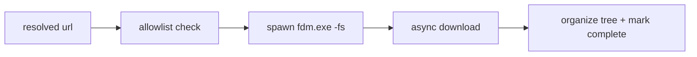

# Skill: launch-fdm

Send a download to FDM silently and organize the finished file into the
canonical folder tree. See [fdm agents](../agents/fdm/fdm.md),
[Rule 07](rules/rule-07-fdm-integration.md) (relative paths are from
`.agents/`).

## Preconditions

- The go-link token has **already been resolved** to a real URL via
  `api.php` (this skill never resolves and never receives a `#fragment`).
- FDM detection has run
  ([fdm-detector](../agents/fdm/fdm-detector/fdm-detector.md)) and the exe
  path is known.

## Steps

1. **Validate the URL** — host must be in the allowlist (gofile, fileknot,
   krakenfiles, mega, pixeldrain, mediafire, anonfiles, etc.).
   Refuse unknown hosts (Rule 10). Strip any trailing literal `\r` from the
   resolver output.
2. **Compose the command** — `fdm.exe -fs "<url>"` using
   `subprocess.Popen(..., shell=False, creationflags=CREATE_NO_WINDOW)`.
   Detach; never wait for FDM's full lifetime.
3. **Record the job** in `download_job` (`status=dispatched`) before spawn.
4. **On completion** (FDM finishes): merge/sanitize per
   [folder-organizer](../agents/fdm/folder-organizer/folder-organizer.md):
   - `<Root>/Games/<Title>/<Title> - <Version> - <Platform>[- <Variant>].<ext>`
   - sanitize `: * ? " < > |`; never overwrite; suffix ` (N)` on collision.
5. **Update status** → `complete` or `failed` with reason.

## Check-off

- [ ] URL host allowlisted
- [ ] trailing `\r` stripped
- [ ] `-fs` silent flag, `shell=False`, `CREATE_NO_WINDOW`
- [ ] job row written before spawn
- [ ] file lands in organized tree, no overwrites

