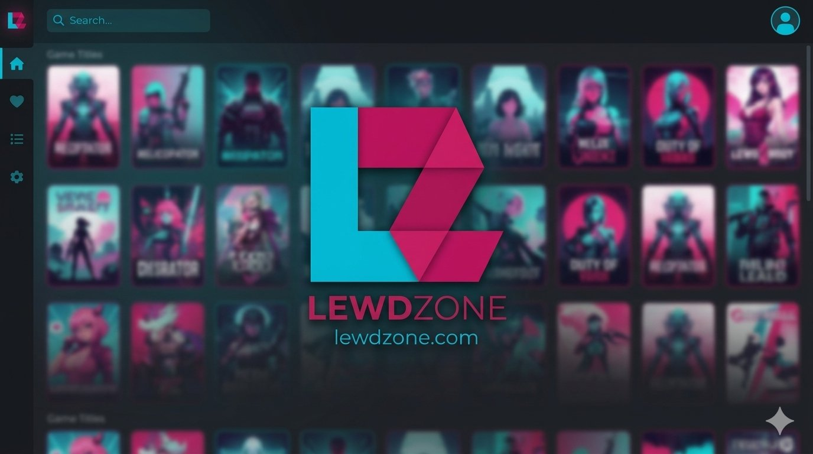

<div align="center">

# 🎮 LewdZone Launcher

  
</div>

> 🚀 **Cross-platform desktop game launcher and native CLI engine** for [LewdZone](https://lewdzone.com) — browse, download, extract, and organize games effortlessly.

A **Tauri 2 desktop app** (Windows, Linux, macOS) paired with a **native Rust CLI** — two entry points into the same Rust core (`src-tauri/src/`). Every GUI action maps 1:1 to a headless, scriptable CLI subcommand. The launcher resolves go-link tokens into real file URLs, streams direct-file hosts in-app with live progress, dispatches cloud hosts to the OS default handler or browser, decompresses archives using the **7-Zip console executable**, and docks to the system tray.

---

## ✨ Features

| Feature | Description |
|---|---|
| 🖥️ **Full Desktop Launcher** | Store, Library, Downloads, Favorites, and Settings views built with Svelte 5 and Tauri 2. |
| ⌨️ **Native Rust CLI Engine** | Headless and scriptable CLI sharing the exact same core logic with `--json` output. |
| 📦 **7-Zip Archive Extraction** | Fast multi-threaded decompression of `.zip`, `.7z`, `.rar`, `.tar.gz`, `.tar.bz2`, `.tar.xz`, and SFX `.exe` archives with real-time progress. |
| 🗂️ **Flat Library Layout** | Clean organization with per-OS `downloads/` and `installed/<slug>/` folders; configurable via `library-root`. |
| 🛎️ **System Tray Integration** | Custom tray icon with context menu (Show LewdZone, Minimize to Tray, Quit) and minimize-to-tray. |
| 🛡️ **In-App Sandboxed Resolver** | Secure child webview for countdown and captcha verification links, isolating ads and trackers; resolves directly into the in-app download queue. |
| 🚫 **Dead/Malicious Host Blacklist** | Open dispatch to all functional mirrors, blocking only dead or unsafe domains (`gofile`, `gofiles`, `zippyshare`, `cdnclick`, `anonfile`, `uptobox`, `qiwi`, etc.). |
| 🕷️ **LewdZone Web Scraper** | Polite, rate-limited scraping of games, tags, versions, download links, and pagination. |
| 🗄️ **Local SQLite Database** | Robust WAL storage holding catalog cache and download jobs; tokens stored instead of URLs. |
| 🎨 **Dynamic Theme Engine** | Runtime token switching with shipped Nord, Dracula, and Material themes. |
| 📚 **External Metadata Enrichment** | Optional enrichment from SteamGridDB, VNDB, IGDB, Steam, itch.io, and IndieDB. |

---

## 🚀 Quick Start

### Build & Run the GUI

```bash
npm install                                           # install frontend dependencies
npm run tauri dev                                     # launch desktop app in development
```

### Use the CLI

```bash
cargo build --manifest-path src-tauri/Cargo.toml      # builds src-tauri/target/debug/lewdzone (or lewdzone.exe on Windows)

# Synchronize catalog from LewdZone
lewdzone sync

# List catalog games
lewdzone list --limit 10

# Inspect a game
lewdzone info treasure-of-nadia

# Configure 7-Zip CLI path and library root
lewdzone settings set 7z-path "C:\Utilities\7z\7za.exe"
lewdzone settings set library-root "G:\LewdZone"

# Download and automatically extract a game
lewdzone download --game treasure-of-nadia --version latest --platform PC --tab official
```

> 💡 Every GUI action maps to a CLI subcommand — learn one, you know the other (Rule 13).

---

## 📚 Documentation

The complete documentation suite lives in the [wiki](../../wiki/Home):

- [Getting Started](../../wiki/Getting-Started)
- [Archive Extraction & 7-Zip Setup](../../wiki/Archive-Extraction)
- [Downloads & In-App Streaming](../../wiki/Download-Managers)
- [Architecture & Design](../../wiki/Architecture)
- [CLI Reference](../../wiki/CLI-Reference)
- [Configuration Reference](../../wiki/Configuration)
- [Theme Development](../../wiki/Theme-Development)
- [Content Providers](../../wiki/Content-Providers)
- [Troubleshooting Guide](../../wiki/Troubleshooting)
- [Installing & Building](../../wiki/Installing-and-Building)
- [Testing & QA](../../wiki/Testing)
- [Security Architecture](../../wiki/Security)
- [Agent Ecosystem & Governance](../../wiki/Agents)

---

## ⚖️ Legal & Policies

View the [License](LICENSE.md), [Privacy Policy](PRIVACY.md), [Terms of Service](TOS.md), and [Security Policy](SECURITY.md).