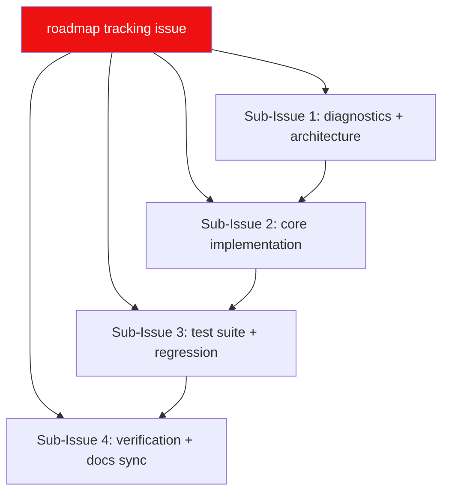

# 🗺️ LewdZone App Build Roadmap

**This is the complete, authoritative roadmap for the repository.** Living plan:
edited in place as work progresses — a tracked twin of the roadmap tracking
[issue #1](https://github.com/HELIX-Origin/lewdzone/issues/1)
([Rule 04](.agents/rules/rule-04-remote-issue-protocol.md)).

> **Accuracy contract:** must always be 100% accurate. When a feature is
> abandoned it is **removed** here and from the roadmap issue — never left as a
> cancelled corpse. When done, it moves to **Done**. History lives in the git
> log, not here.

## 🧭 North Star

Cross-platform desktop game launcher for lewdzone.com: Storefront
(browse/search/download), Library (icons, covers, descriptions), Downloads
(queue), Settings. **Single Tauri 2 binary** with two faces: a windowed GUI
(SvelteKit frontend in `src/`, Rust core in `src-tauri/`) and a native Rust CLI
(same core, clap commands, `--json` machine output). Internal folders mirror a
classic launcher layout
([ADR-0005](.agents/adr/0005-steam-mirror-folder-structure.md)).

## 🗓️ Plan

## Done ✅

- [x] `.agents/` ecosystem — 10 families, rules 00–13, skills, wiki, ADRs 0001–0006
- [x] GitHub repo + initial push
- [x] Root docs: `AGENTS.md`, wiki (16 pages), legal pages (LICENSE/PRIVACY/TOS/SECURITY)
- [x] Restructure: Python CLI deleted; repo root IS the Tauri 2 app (`src/` + `src-tauri/`)
- [x] Native Rust CLI core (clap): sync/search/info/download/list/settings/shortcuts/launch/favorites + exit-code contract (0–5) + `--json`
- [x] Shared core: paths, settings, library, skins/theme system (ADR-0005) — Rust tests green
- [x] Tauri commands bridge: settings_get/settings_set/themes_list/themes_tokens/themes_apply
- [x] App shell: topbar nav (Store/Library/Downloads/Settings) + 4 placeholder views; frontend vitest suites green, svelte-check green
- [x] Toolchain (Rust 1.98 / MSVC via VS2026 Build Tools), cargo test + clippy + fmt green
- [x] Scraper family: archive card parser with `?page=N` pagination, game-page parser (versions, tabs, genres, screenshots), polite fetch with bounded retries
- [x] Resolver family: go-link token → start/reveal API → real URL, retries, host allowlist (Rule 10)
- [x] Download dispatch: version/platform/tab selection; direct-file hosts stream in-app, others open via OS default handler
- [x] SQLite catalog: forward-only migrations, repo layer, resumable sync pipeline + prune (Rule 06, ADR-0003)
- [x] `list` + `info` CLI commands backed by the synced catalog
- [x] Docs/CLI drift cleanup: README, wiki, and `.agents` docs now match the real CLI (`download`, `list --library`/`--jobs`, no `--manager`/`--status`)
- [x] **Memory-first architecture with SQLite persistence**: In-memory caching (`AppState` `game_cache`, `page_cache`, `genres_cache`) for instant 0ms responses; SQLite database fallback; automatic upsert upon network fetch; complete model deserialization in `db::repo::game_by_slug`
- [x] **Storefront game detail fixes**: Safe Svelte 5 reactive rendering, request deduplication, and single-version game fallback support
- [x] **Removed external metadata providers (ADR-0006)**: Eliminated external providers (IGDB, VNDB, Steam, SteamGridDB, itch, IndieDB) so store pages load reliably without network stalling
- [x] **Discontinued desktop shortcuts (ADR-0006)**: Abandoned desktop shortcut creation due to site lacking square icon assets; cleaned up Library UI and CLI handlers
- [x] **Settings preferred sources toggle grid**: Interactive multi-toggle button grid for all 12 allowlisted cloud hosts in Settings
- [x] **GUI relayout** to dark cyberpunk spec: left icon sidebar + top header, deep cyan/charcoal gradient, neon accents, glassmorphism, thin scrollbar
- [x] **Library = downloaded games**: list installed titles from `lzapps/<slug>/app.json`; launch support from the Library view
- [x] **Multi-format launch**: infer game binary via engine/tag taxonomy so Launch opens the right target
- [x] Custom macOS-style title bar: frameless window (`decorations: false`) + traffic lights (red/yellow/green) + custom File/View/Help menus + profile button
- [x] Download scheduler: `download-grace-seconds` pacing between dispatch starts
- [x] **Non-blocking async download queue** (Rust core): `game_download` enqueues and returns instantly; background worker resolves + dispatches one request at a time
- [x] **Downloads page**: poll `downloads_list` and render each job's status/message
- [x] Persist `download_job` rows + resume across restarts
- [x] Storefront catalog view: real tiles + game-page lookup; clickable tiles navigate to detail
- [x] App icons: generated from `assets/appicon.png` via `tauri icon` and wired into bundle config
- [x] Favorites: SQLite-backed heart toggle on Library tiles + Favorites page
- [x] Live archive pagination verification (`/games/page/N/`)

## Now 🚧 (Phase 2 — Download Flow & Source Selection)

- [ ] **Child Webview for Downloads**: Implement child webview window setup to allow users to interact with and solve host redirect challenges / human verifications, enabling the launcher app to capture the final direct download URL directly.
- [ ] **Storefront Download Source Selection**: Implement interactive selection of download sources directly from the game's store detail page.

## Later ⏳

### Phase 3 — Test Suite & Regression
- Frontend unit tests for all views
- App/CLI parity tests + protocol tests
- Coverage floors: 85% overall, ~90% core, ~70% gui

### Phase 4 — Packaging & Distribution
- Packaging: MSI+NSIS, .app+DMG, AppImage+deb+rpm, updater
- **Releases page:** prebuilt installers per OS+arch (no npm/GitHub Packages publishing — the CLI ships inside the app bundle)

### Phase 5 — Verification & Release
- Release gate (cargo test/clippy/fmt, vitest, svelte-check, security, build smoke)
- Docs sync → wiki, release notes, tag `v0.1.0`

## ✅ Acceptance Criteria

- [x] `lewdzone --help` clean on PowerShell and bash
- [x] `download --game treasure-of-nadia --json` resolves and dispatches (direct-file hosts stream in-app; others open via OS default handler)
- [x] Store/Library/Downloads/Settings all map 1:1 to an invoke command or CLI command
- [x] Files land in `<downloads>/Games/<Title>/` staging and `<lzapps>/<slug>/` installs
- [x] Rust + frontend suites green on CI

## 🔗 Related

In-repo: `TODO.md`, `BUGS.md`, `AGENTS.md`, wiki pages (Architecture,
CLI-Reference, Download-Managers, Development). Living spec: `.agents/rules/index.md`.
ADRs: `.agents/adr/` (storage/settings patterns).