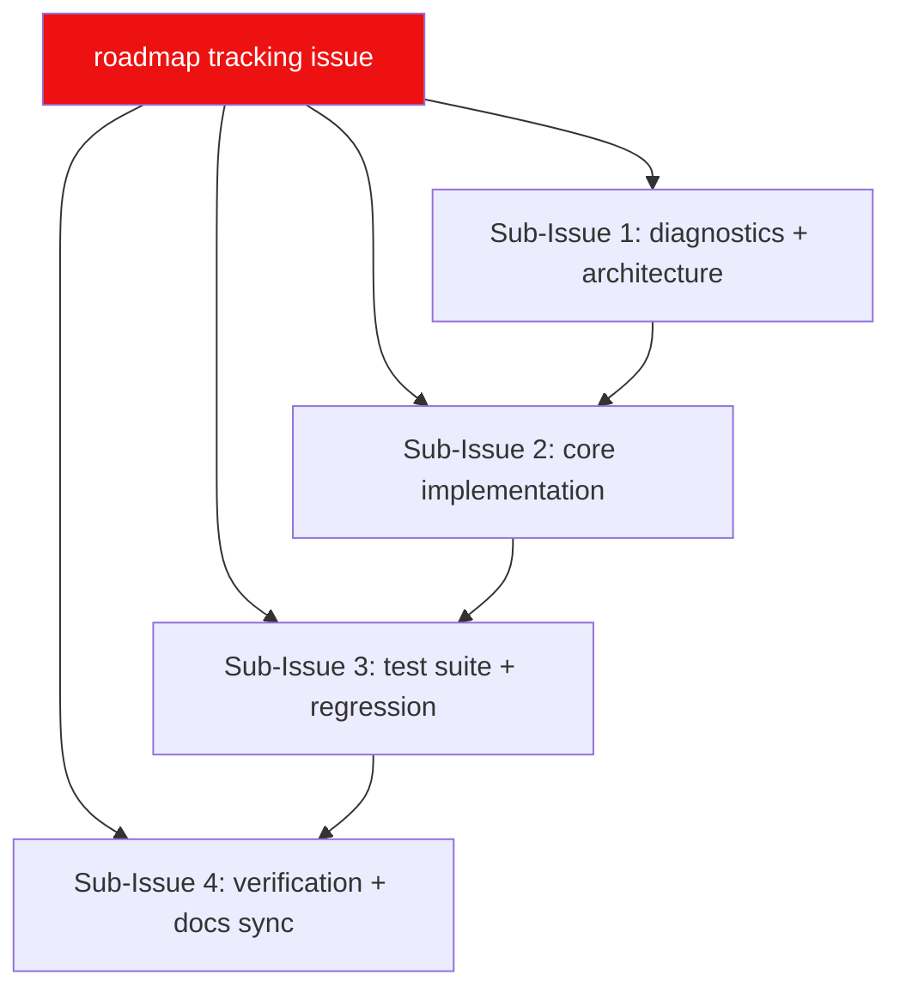

# LewdZone Launcher — Repo Roadmap

**This document is the complete, authoritative roadmap for the entire
repository — from the very first commit onward.**

> **Accuracy contract:** ROADMAP.md must always be 100% accurate. It maps every
> feature we are working on. When a feature is abandoned, it is **removed** from
> this file (never marked "cancelled" and left dangling). When a feature is
> done, it moves to the right list. There is no history kept here — the git log
> is the history. Current status is in the **Done** and **Now** sections.
> The canonical tracked copy mirrors this file in the roadmap-first GitHub
> issue (Rule 04).

**Central command:** `🗺️ LewdZone App Build Roadmap` — the single living
tracking issue on GitHub. This file is its in-repo twin. Items here move
together; the issue body is updated when this file changes.

---

## North Star

A cross-platform desktop **game launcher** for lewdzone.com: browse a
Steam-like store, queue downloads, organize files, and create native shortcuts.
Tauri 2 app drives a Python CLI sidecar over JSON/JSONL. The CLI is the engine
(scriptable headless); the app is the primary product; the app never imports
the Python package or talks to the site/DB directly.

## Overview

---

## Done ✅

Everything shipped to `main`. (Initial push: `5d65506`.)

### Phase 0 — Foundation
- [x] `.agents/` agent ecosystem — 10 families, rules 00–13, skills, wiki
- [x] GitHub repo `HELIX-Origin/LewdZone-Launcher` + initial push
- [x] Root docs: `AGENTS.md`, `wiki/` (16 pages), `.gitignore`
- [x] `ROADMAP.md`, `TODO.md`, `BUGS.md` created (this trio)

## Now 🚧

Currently worked. **No sub-issues have been created on GitHub yet** — the
roadmap issue is the umbrella; sub-issues come from these items.

### Phase 1 — Diagnostics & Architecture
- [ ] Scraping proof: archive pagination scheme (`?page=N` vs `/page/N/`)
- [ ] Mermaid compliance cleanup across `.agents/agents/*` (Rule 09)
  - systems-designer subgraph quoting + `lewzodone.com` typo
  - gui/testing subgraph quoting; dm-detector/folder-organizer label quoting
- [ ] `src/lewdzone_launcher/` scaffold + import-linter contract (Rule 03)
- [ ] ADRs for cross-layer contracts
- [ ] Config + sqlite bootstrap (`_config.py`, WAL schema, migrations)

## Later ⏳

### Phase 2 — Core Implementation
- [ ] Scraper: catalog, game page, versions, download entries, genre tags
- [ ] Resolver: go-token `start` → `reveal`, retry, `\r` strip
- [ ] DM adapters: FDM, IDM, uTorrent/BitTorrent + detector + folder-organizer
- [ ] Job queue + sync pipeline (incremental, rate-limited)
- [ ] CLI commands: `sync/search/info/download/list/settings/shortcuts/launch/dm`
  with `--json` / `--jsonl` machine contract

### Phase 3 — Test Suite & Regression
- [ ] vitest-style suites: unit/integration/live, fakes in `tests/support/`
- [ ] App/CLI parity tests + sidecar protocol tests
- [ ] Coverage floors: 85% overall, ~90% core, ~70% gui

### Phase 4 — Desktop App & Shortcuts
- [ ] Tauri 2 shell: Rust core, sidecar-driver, window lifecycle
- [ ] Svelte views: Store / Library / Downloads / Settings
- [ ] Native shortcuts (.lnk / .desktop / .app) + SteamGridDB artwork
- [ ] Packaging: MSI+NSIS, .app+DMG, AppImage+deb+rpm, updater

### Phase 5 — Verification & Release
- [ ] Release gate green (pytest, ruff, pyright, security, build smoke)
- [ ] Docs synced back to `wiki/`; release notes; tag `v0.1.0` / `v1.0.0`

## Abandoned 🗑️

*Nothing abandoned yet. When a feature is dropped, delete it from all sections
above (and from the tracking issue) — do not leave a corpse.*

---

## Acceptance Criteria (project-level)

- [ ] `lewdzone-launcher --help` clean on PowerShell **and** bash
- [ ] `lewdzone-launcher download --game treasure-of-nadia --version latest --platform PC --tab official --manager fdm --json` resolves and dispatches to a real DM
- [ ] Store/Library/Downloads/Settings pages all work; every action maps 1:1 to a CLI command
- [ ] Torrent links only accepted by a torrent-capable manager
- [ ] Files land in `<DownloadRoot>/Games/<Title>/<Title> - <Version> - <Platform>.ext`
- [ ] Full test suite + coverage floors green on CI

## Related

- [AGENTS.md](AGENTS.md) — operating manual
- [TODO.md](TODO.md) — fine-grained work queue (next steps)
- [BUGS.md](BUGS.md) — open bugs only
- [wiki](wiki/Home) — living documentation suite