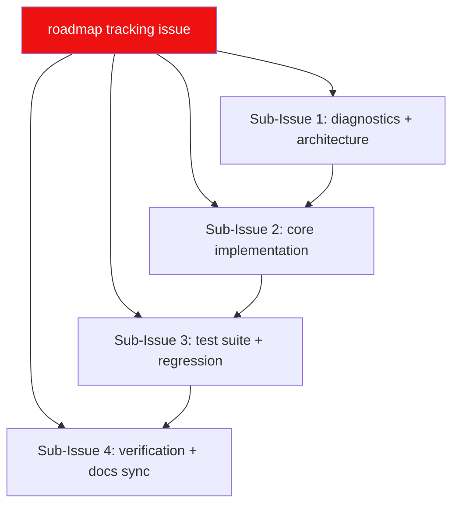

# 🗺️ LewdZone App Build Roadmap

**This is the complete, authoritative roadmap for the repository.** Living plan:
edited in place as work progresses — a tracked twin of the roadmap tracking
[issue #1](https://github.com/HELIX-Origin/lewdzone/issues/1)
([Rule 04](.agents/rules/rule-04-remote-issue-protocol.md)).

> **Accuracy contract:** must always be 100% accurate. When a feature is
> abandoned it is **removed** here and from the roadmap issue — never left as a
> cancelled corpse. When done, it moves to **Done**. History lives in the git
> log, not here.

---

## 🧭 North Star

Cross-platform desktop game launcher for lewdzone.com: Storefront
(browse/search/download), Library (icons, covers, descriptions), Downloads
(queue with live streaming & 7-Zip extraction progress), Favorites, and Settings. **Single Tauri 2 binary** with two faces: a windowed GUI
(Svelte frontend in `src/`, Rust core in `src-tauri/`) and a native Rust CLI
(same core, clap commands, `--json` machine output).

---

## 🗓️ Plan

---

## Done ✅

All Phase 1, Phase 2, and Phase 3 milestone items are completed and recorded in `git log`:

- [x] **Base system & architecture:** Tauri 2 desktop shell with Svelte 5 frontend and native Rust CLI (Rule 03, Rule 13).
- [x] **LewdZone Scraper:** Catalog archive pagination, game detail extraction, version tabs, and genre cloud parsing.
- [x] **Resolver:** Go-link `#t=v1...` token resolution via `start` → `reveal` API with host blacklist protection (`gofile`, `zippyshare`, `cdnclick`).
- [x] **In-App Sandboxed Resolver:** Child webview for verification countdowns and captcha challenges, blocking adware and redirects.
- [x] **Downloads & Streaming:** In-app direct file streaming (`fileknot`) with live byte progress, speed calculation, and native OS dispatch for cloud hosts.
- [x] **Queue Management:** Multi-state queue (`queued`, `resolving`, `downloading`, `extracting`, `complete`, `failed`, `cancelled`), with cancel and delete controls for active and queued jobs.
- [x] **7-Zip Multi-Format Extraction:** Fast, multi-threaded archive extraction (`.zip`, `.7z`, `.rar`, `.tar`, `.exe`) using standalone 7-Zip CLI (`7za`/`7z`/`7zz`) with real-time percentage progress streaming and immediate cancellation.
- [x] **Flat Library Layout:** Archives land flat in `<library-root>/downloads/<archive>` and installs reside in `<library-root>/installed/<slug>/` with an `app.json` manifest.
- [x] **Library Scanning & Launch:** Scans personal games directory (`games-dir`), generates manifests, and launches installed games safely.
- [x] **System Tray Integration:** Custom tray icon with context menu (Open, Library, Downloads, Store, Settings, Check for Updates, Quit) and minimize-to-tray.
- [x] **Themes Engine:** Shipped Nord, Dracula, and Material reference themes with runtime CSS token switching.
- [x] **Test Suites:** 183 passing Rust unit and integration tests, 31 passing frontend Vitest tests, clippy and svelte-check green.
- [x] **Documentation Sync:** 100% synchronized wiki pages and repository documentation.

---

## Now 🚧 (Phase 4 — Packaging & Distribution)

- [ ] Automated packaging for all platforms:
  - Windows: NSIS installer (`.exe`) + MSI package (`.msi`)
  - macOS: Application bundle (`.app`) + Apple Disk Image (`.dmg`)
  - Linux: AppImage (`.AppImage`) + Debian package (`.deb`) + RPM (`.rpm`)
- [ ] Release channel updater configuration (`@tauri-apps/plugin-updater`).

---

## Later ⏳ (Phase 5 — Verification & Official Tag)

- [ ] Run full release gate:
  - `cargo fmt --check`, `cargo clippy -- -D warnings`, `cargo test`
  - `npm run check`, `npm run test`
  - `npm run tauri build`
  - `lewdzone --version` smoke test
- [ ] Create annotated git tag `v0.1.0` and publish release notes.

---

## ✅ Acceptance Criteria

- [x] `lewdzone --help` and `lewdzone --version` clean on PowerShell and bash
- [x] `download --game treasure-of-nadia --json` resolves, streams in-app, extracts with 7-Zip CLI, and registers in Library
- [x] Store, Library, Downloads, Favorites, and Settings views map 1:1 to Rust core commands
- [x] Downloads land flat in `<library-root>/downloads/` and installs unpack to `<library-root>/installed/<slug>/`
- [x] System tray allows minimizing to background and provides full context navigation
- [x] Rust (183 tests) + frontend Vitest (31 tests) suites 100% green

---

## 🔗 Related

In-repo: `TODO.md`, `BUGS.md`, `AGENTS.md`, and [wiki](../../wiki/Home). Living spec: `.agents/rules/index.md`.