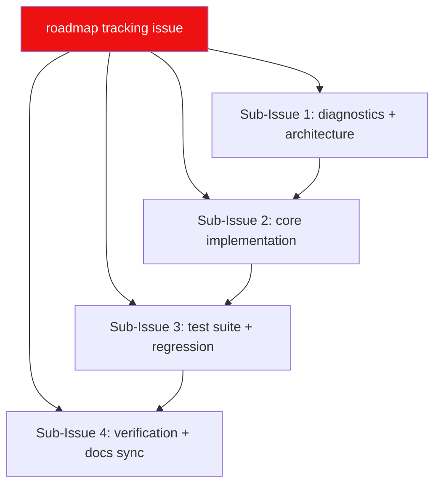

# 🗺️ LewdZone App Build Roadmap

**This is the complete, authoritative roadmap for the repository.** Living plan:
edited in place as work progresses — a tracked twin of the roadmap tracking
[issue #1](https://github.com/HELIX-Origin/lewdzone/issues/1)
([Rule 04](.agents/rules/rule-04-remote-issue-protocol.md)).

> **Accuracy contract:** must always be 100% accurate. When a feature is
> abandoned it is **removed** here and from the roadmap issue — never left as a
> cancelled corpse. When done, it moves to **Done**. History lives in the git
> log, not here.

## North Star

Cross-platform desktop game launcher for lewdzone.com: Steam-like Store
(browse/search/download), Library (icons, covers, descriptions), Downloads
(queue), Settings. **Single Tauri 2 binary** with two faces: a windowed GUI
(SvelteKit frontend in `src/`, Rust core in `src-tauri/`) and a native Rust CLI
(same core, clap commands, `--json` machine output). Internal folders mirror the
Steam client layout
([ADR-0005](.agents/adr/0005-steam-mirror-folder-structure.md)).

## Plan

## Done ✅

- [x] `.agents/` ecosystem — 10 families, rules 00–13, skills, wiki, ADRs 0001–0005
- [x] GitHub repo + initial push
- [x] Root docs: `AGENTS.md`, wiki (16 pages), legal pages (LICENSE/PRIVACY/TOS/SECURITY)
- [x] Restructure: Python CLI deleted; repo root IS the Tauri 2 app (`src/` + `src-tauri/`)
- [x] Native Rust CLI core (clap): sync/search/info/download/list/settings/shortcuts/launch/dm + exit-code contract (0–5) + `--json`
- [x] Shared core: paths, settings, library (Steam-mirror), skins/theme system (ADR-0005) — Rust tests green
- [x] Tauri commands bridge: settings_get/settings_set/themes_list/themes_tokens/themes_apply
- [x] App shell: topbar nav (Store/Library/Downloads/Settings) + 4 placeholder views; frontend vitest suites green, svelte-check green
- [x] Toolchain (Rust 1.98 / MSVC via VS2026 Build Tools), cargo test + clippy + fmt green

## Now 🚧 (Phase 2 — Storefront + Core)

- [ ] Fix any remaining verification gaps (final svelte-check pass, clippy/fmt clean)
- [ ] Storefront catalog view: real tiles + game-page lookup (search/content-provider layer)
- [ ] Scraper: catalog pagination (`?page=N`), game pages, version/download links, genres
- [ ] Resolver: go/redirect → reveal link, retry, download token handling
- [ ] DM adapters (FDM, IDM, uTorrent/BitTorrent) + detector + folder-organizer
- [ ] Download queue + incremental sync pipeline (core `sync`/`download`/`dm`)
- [ ] Router recreation of store pages (ripped UI mirrored into local HTML)

## Later ⏳

### Phase 3 — Test Suite & Regression
- Frontend unit tests for all four views
- App/CLI parity tests + protocol tests
- Coverage floors: 85% overall, ~90% core, ~70% gui

### Phase 4 — Packaging & Shortcuts
- Native shortcuts (.lnk / .desktop / .app) + SteamGridDB artwork
- Packaging: MSI+NSIS, .app+DMG, AppImage+deb+rpm, updater
- **Releases page:** prebuilt installers per OS+arch
- **GitHub Packages (npm):** CLI-only package for headless/no-GUI users

### Phase 5 — Verification & Release
- Release gate (cargo test/clippy/fmt, vitest, svelte-check, security, build smoke)
- Docs sync → wiki, release notes, tag `v0.1.0` / `v1.0.0`

## Abandoned 🗑️

- Python CLI sidecar (lewdzone_launcher package, pytest suites) — replaced by
  native Rust core + vitest; removed from repo.

## Acceptance Criteria

- [ ] `lewdzone --help` clean on PowerShell and bash
- [ ] `download --game treasure-of-nadia --manager fdm --json` resolves and dispatches
- [ ] Store/Library/Downloads/Settings all map 1:1 to an invoke command or CLI command
- [ ] Torrent links only accepted by a torrent-capable manager
- [ ] Files land in `<Library>/common/<Title>/` per ADR-0005 mirror layout
- [ ] Rust + frontend suites green on CI

## Related

In-repo: `TODO.md`, `BUGS.md`, `AGENTS.md`, wiki pages (Architecture,
CLI-Reference, Download-Managers, Development). Living spec: `.agents/rules/index.md`.
ADRs: `.agents/adr/` (storage/settings patterns).