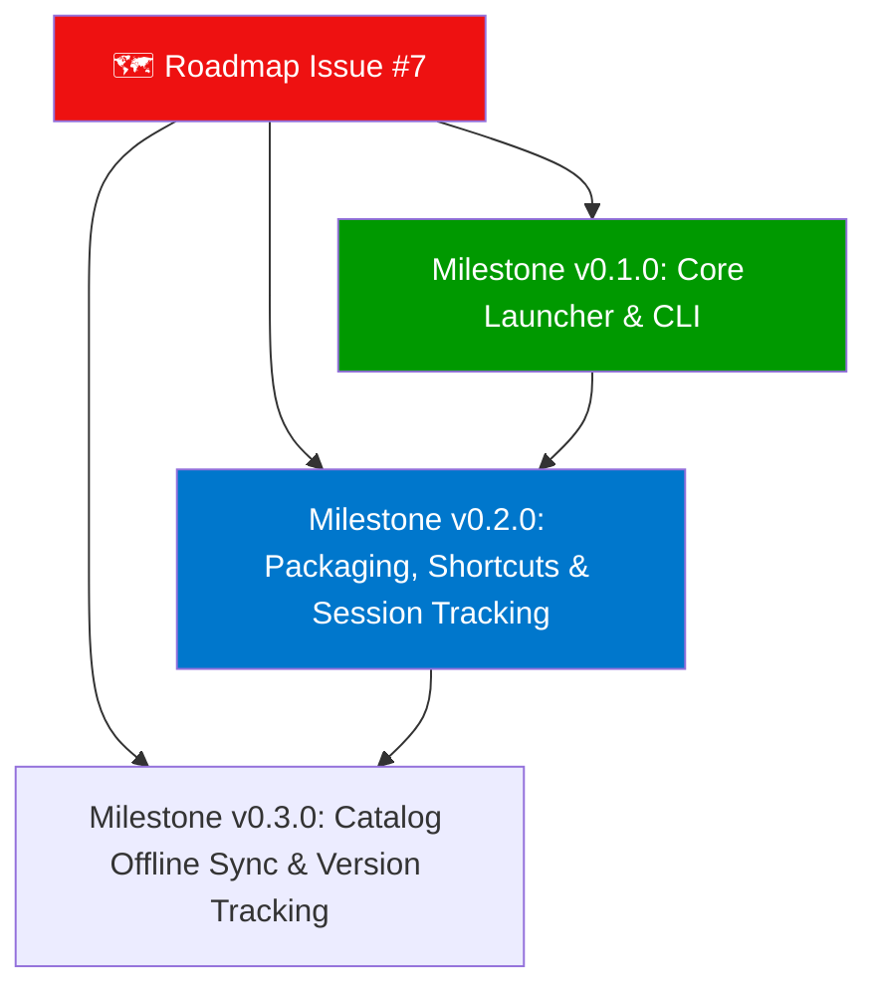

# 🗺️ LewdZone App Build Roadmap

**This is the complete, authoritative roadmap for the repository.** Living plan:
edited in place as work progresses — a tracked twin of the roadmap tracking
[issue #7](https://github.com/HELIX-Origin/LewdZone-Launcher/issues/7)
([Rule 04](.agents/rules/rule-04-remote-issue-protocol.md)).

> **Accuracy contract:** must always be 100% accurate. When a feature is
> abandoned it is **removed** here and from the roadmap issue — never left as a
> cancelled corpse. When done, it moves to **Done**. History lives in the git
> log, not here.

---

## 🧭 North Star

Cross-platform desktop game launcher for lewdzone.com: Storefront
(browse/search/download), Library (icons, covers, descriptions), Downloads
(queue with live streaming & 7-Zip extraction progress), Favorites, and Settings.
**Single Tauri 2 binary** with two faces: a windowed GUI (Svelte frontend in `src/`,
Rust core in `src-tauri/`) and a native Rust CLI (same core, clap commands, `--json`
machine output).

---

## 🗓️ Plan

---

## Done ✅ (v0.1.0 Initial Release)

All foundational architecture, core engine, desktop GUI, CLI, and v0.1.0 release milestones are complete:

- [x] **Base system & architecture:** Tauri 2 desktop shell with Svelte 5 frontend and native Rust CLI with 100% feature parity (Rule 03, Rule 13).
- [x] **LewdZone Scraper:** Rate-limited catalog pagination, game detail extraction, version tabs, and genre cloud parsing.
- [x] **Resolver:** Go-link `#t=v1...` token resolution via `start` → `reveal` API with active host blacklist protection (`gofile`, `zippyshare`, `cdnclick`, `anonfiles`, `uptobox`, `yourfilestore`, `qiwi`, `transfersh`).
- [x] **In-App Sandboxed Resolver:** Child webview for verification countdowns and captcha challenges, blocking adware, popups, and tracker redirects.
- [x] **Downloads & Streaming:** In-app direct file streaming (`fileknot`, `pixeldrain`, `mediafire`, `workupload`) with live byte progress, speed calculation, and native OS dispatch for cloud file lockers.
- [x] **Queue Management:** Multi-state queue (`queued`, `resolving`, `dispatching`, `downloading`, `extracting`, `completed`, `dispatched`, `failed`, `cancelled`), with cancel and delete controls for active and queued jobs.
- [x] **7-Zip Multi-Format Extraction:** Fast, multi-threaded archive extraction (`.zip`, `.7z`, `.rar`, `.tar.gz`, `.tar.bz2`, `.tar.xz`, SFX `.exe`) using standalone 7-Zip CLI (`7za`/`7z`/`7zz`) with real-time percentage progress streaming and immediate cancellation.
- [x] **Flat Library Layout:** Archives land flat in `<library-root>/downloads/<archive>` and installs reside in `<library-root>/installed/<slug>/` with an `app.json` manifest.
- [x] **Library Scanning & Launch:** Scans personal games directory (`games-dir`), generates manifests, and launches installed games safely.
- [x] **System Tray Integration:** Custom tray icon with context menu (Open, Library, Downloads, Store, Settings, Quit) and minimize-to-tray.
- [x] **Dynamic Theming Engine:** Shipped Nord, Dracula, and Material reference themes with runtime CSS token switching without app restart.
- [x] **Metadata & Artwork Enrichment:** Multi-provider enrichment via SteamGridDB, VNDB, IGDB, itch.io, Steam, and IndieDB with secure SQLite secret storage.
- [x] **Comprehensive Documentation:** Full 17-page GitHub Wiki suite covering Getting Started, 7-Zip CLI guide, CLI reference, and architecture.
- [x] **GitHub Community Governance:** Detailed YAML issue forms suite (9 templates + config) and automation workflows (failed run cleanup and discussion seeding).
- [x] **Test Suites & Verification Gate:** 184 passing Rust unit and integration tests, 31 passing frontend Vitest tests, clippy and svelte-check green.
- [x] **Official Initial Release:** Tagged [`v0.1.0`](https://github.com/HELIX-Origin/LewdZone-Launcher/releases/tag/v0.1.0) with published showcase release notes.

---

## Done ✅ (v0.4.1 — Resolver cleanup, unified extraction, installer titlebar)

- [x] **Resolver UI Cleanup:** Removed the redundant "Open in Browser" button from the Secure Ad-Free Resolver; "Open in App" remains the primary capture path.
- [x] **Unified Archive Extraction:** Direct-stream downloads now auto-extract every supported archive format (`.zip`, `.7z`, `.rar`, `.tar.*`, SFX `.exe`) instead of only `.zip`, and delete the archive after successful extraction.
- [x] **Duplicate Folder Prevention:** Background scanner skips archives that are still being written or are already handled by an active queue job.
- [x] **Unified Installer Titlebar:** Installer wizard uses the same frameless traffic-light titlebar as the main app.

## Now 🚧 (Milestone v0.5.0 — Application Self-Updater)

- [ ] **Application Self-Updater**:
  - Configure Tauri updater (`@tauri-apps/plugin-updater`) for automated background updates from GitHub Releases.

## Next ⏳ (Milestone v0.6.0 — Offline Catalog & Version Tracking)

- [ ] **Offline Catalog Synchronization**:
  - Background SQLite catalog sync for instant search, filtering, and offline catalog browsing.
- [ ] **Game Update Detection**:
  - Periodic background checks detecting new game versions released on LewdZone.
  - One-click update workflow preserving save files and user data.
- [ ] **Custom Theme Creator GUI**:
  - Visual theme editor in Settings allowing users to customize CSS tokens and export theme files.

---

## Later ⏳ (Milestone v0.3.0 — Offline Catalog & Version Tracking)

- [ ] **Offline Catalog Synchronization**:
  - Background SQLite catalog sync for instant search, filtering, and offline catalog browsing.
- [ ] **Game Update Detection**:
  - Periodic background checks detecting new game versions released on LewdZone.
  - One-click update workflow preserving save files and user data.
- [ ] **Custom Theme Creator GUI**:
  - Visual theme editor in Settings allowing users to customize CSS tokens and export theme files.

---

## ✅ Acceptance Criteria

- [x] `lewdzone --help` and `lewdzone --version` clean on PowerShell and bash
- [x] `download --game treasure-of-nadia --json` resolves, streams in-app, extracts with 7-Zip CLI, and registers in Library
- [x] Store, Library, Downloads, Favorites, and Settings views map 1:1 to Rust core commands
- [x] Downloads land flat in `<library-root>/downloads/` and installs unpack to `<library-root>/installed/<slug>/`
- [x] Standalone 7-Zip CLI configuration verified across Windows, macOS, and Linux
- [x] System tray allows minimizing to background and provides full context navigation
- [x] Rust (183 tests) + frontend Vitest (31 tests) suites 100% green
- [x] Tag `v0.1.0` published on GitHub Releases

---

## 🔗 Related

In-repo: `TODO.md`, `BUGS.md`, `AGENTS.md`, and [wiki](../../wiki/Home). Living spec: `.agents/rules/index.md`.