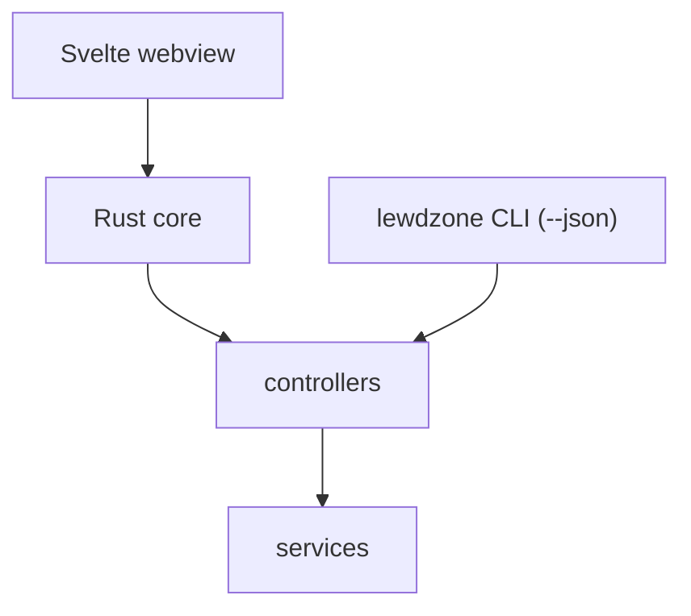

# Architecture

> Links between wiki pages are relative and omit the `.md` extension.

## Two entry points, one core

lewdzone is a **modular layered monolith** with two entry points into
one Rust core:

| Entry point | Role | Talks to |
| --- | --- | --- |
| **Tauri 2 desktop app** | primary product (Svelte webview) | core commands |
| **Native Rust CLI** | the engine, headless/scriptable | core commands, same functions |

The Tauri binary re-exposes the Rust core as a CLI (`src-tauri/src/cli.rs`);
both entry points call the same functions — no duplication, no serialization
hand-off.

## Layer contract (inner = pure)

| Layer | Contains | May use |
| --- | --- | --- |
| `src/` (Tauri webview) | Svelte views (Store / Library / Downloads / Settings) | core commands only; never site or DB |
| `src-tauri/src/` (Rust core) | `cli.rs`, `db.rs`, `scraper.rs`, `resolver.rs`, `content.rs`, `dm.rs`, domain structs | inner layers only |
| controllers | game, download, sync, shortcut, artwork, content commands | services + domain |
| domain | `Game`, `Version`, `DownloadEntry`, `GoToken` (plain structs) | stdlib only |
| services | scraping, resolver, db, dm adapters, shortcuts, artwork, content providers | domain |
| external | lewdzone.com, FDM/IDM/torrent, sqlite, SteamGridDB/VNDB/IGDB/itch/Steam/IndieDB, native shortcuts | — |

Import rule: **inward only**. Domain never imports IO; services never import
controllers; the webview never touches services directly. Enforced via the
crate's module boundaries (Rule 03). Full rule: [Rule 03](https://github.com/helix-origin/lewdzone-launcher/tree/main/.agents/rules/rule-03-module-architecture.md) —
link resolves on the wiki; in the repo it's `.agents/rules/rule-03-module-architecture.md`.

## CLI machine contract

- **Query commands** (`info`, `search`, `list`, …): one `--json` document.
- **Long-running commands** (`sync`, `download`, `shortcuts`, …): progress
  goes to **stderr**; stdout gets exactly one machine-parseable `--json`
  document on completion.
- stdout is the protocol channel; stderr is diagnostics. Never parse stderr as
  data.
- The GUI does **not** parse this stream: GUI actions call the same core
  functions directly and get typed results in-process (Rule 13).



## Data model

- SQLite catalog stores go-link **tokens**, never resolved URLs (resolved URLs
  are ephemeral).
- Core tables: `game`, `genre`, `game_genre`, `version`, `download_entry`,
  `host`, `download_job`; enrichment `game_external`
  (`post_id → provider → external_id`) and `artwork_cache` (gains `provider` +
  `kind` columns).
- Config + DB live in the per-OS config dir; see [Configuration](Configuration).

## Folder structure (Steam mirror, ADR-0005)

The on-disk layout mirrors the Steam client's, so the launcher *is* a game
launcher — same shape as Steam, different target site + palette:

```
<data_root>/lewdzone/          # %APPDATA% / ~/Library/Application Support / $XDG_DATA_HOME
  lewdzone.db                           # SQLite catalog (WAL, FK, tokens only)
  config.json                           # JSON settings (Rule 10 secrets redacted)
  appcache/                             # cached catalog/site data
  logs/<component>.log                  # per-subsystem logs (Steam logs/ analog)
  library/                              # "steamapps" analog
    libraryfolders.json                 # ordered library roots (Steam libraryfolders.vdf analog)
    appmanifest_<post_id>.json          # per-game manifest (Steam appmanifest_*.acf analog)
    common/<Game Title>/                # installed games
    downloading/<post_id>/              # in-progress downloads
    artwork/<post_id>_<kind>.png        # hero / logo / p / bare grid art
  userdata/<local_user_id>/             # per-user config + shortcuts
<cache_root>/lewdzone/         # %LOCALAPPDATA% / ~/Library/Caches / $XDG_CACHE_HOME
  htmlcache/                            # webview/tile cache (Steam htmlcache analog)
<documents>/My Games/<Game Title>/      # per-game saves (Steam Documents\My Games analog)
<config_root>/lewdzone/skins/<Name>/   # theme skins (classic Steam skins/)
```

- Manifest files (`appmanifest_<post_id>.json`) are the source of truth for
  "installed"; `libraryfolders.json` holds ordered roots (`library-root`
  setting picks the active one; see [Configuration](Configuration)).
- Downloads stage into `downloading/<post_id>/` and publish to
  `common/<Title>/` on completion.
- Artwork files under `library/artwork/` are indexed by `artwork_cache` in
  SQLite (ADR-0004); the Theme picker (skins) is first-class and, unlike Valve,
  is retained as a core capability ([ADR-0005](../.agents/adr/0005-steam-mirror-folder-structure)).

## Content enrichment pipeline

Not every LewdZone page carries full metadata (indie/amateur titles are often
thin). A pluggable **content-provider layer** fills info + art gaps without
overwriting LewdZone download data:

1. `content` controller asks the provider registry for enabled providers in
   priority order (`steamgriddb, vndb, igdb, itch, steam, indiedb`).
2. Each provider searches the title; the first match maps to
   `game_external(post_id, provider, external_id)` (upsert, idempotent).
3. `fetch_info` fills only *missing* fields: description, developer, release
   date, screenshots, rating, tags, store link.
4. `fetch_asset` pulls art by kind: SteamGridDB icons/grids/heroes/logos;
   VNDB cover + screenshots; IGDB covers/artworks; itch/IndieDB page art.
5. Artwork is cached in `artwork_cache` (keyed by `(normalized_title, kind)`,
   tagged with `provider`) and used again on rebuilds (offline-fast).

APIs: SteamGridDB v2 (Bearer key), VNDB Kana (keyless), IGDB v4
(Client-ID + Twitch token), itch.io HTML scrape, Steam Storefront (keyless,
only for already-mapped appids), IndieDB HTML scrape (no public API). API keys
are pasted by the user in the app's **Settings → API keys** section and
persisted securely (Rule 10) — never echoed back. Providers degrade
gracefully: an outage or missing key means "no enrichment", never a broken
listing or download. See [Agents](Agents) for the `content` family.

## Download pipeline

1. Scraper collects `game`/`version`/`download_entry` rows from the site
   (tokens, not URLs).
2. Resolver turns a chosen token into a real URL via the site's
   `start` → `reveal` API (rate-limited).
3. **The tool never downloads files itself.** The resolved URL is handed to an
   installed download-manager adapter (FDM / IDM / torrent).
4. `folder-organizer` folds the result into
   `<DownloadRoot>/Games/<Title>/<Title> - <Version> - <Platform>[- <Variant>].<ext>`.

See [Download Managers](Download-Managers).

## Packaging

`tauri build` produces:

| Platform | Formats |
| --- | --- |
| Windows | NSIS + MSI |
| macOS | `.app` + DMG |
| Linux | AppImage + deb + rpm |

The CLI ships as part of the app binary itself (Rule 13): the same executable
provides the `lewdzone` command, so no sidecar artifact is bundled.

## Cross-platform rules

- Config dirs: `%APPDATA%` (Windows), `~/.config` or `$XDG_CONFIG_HOME` (Linux),
  `~/Library/Application Support` (macOS).
- Spawn flags (when invoking download managers or shortcuts): `CREATE_NO_WINDOW`
  (Windows) vs detached POSIX session; never launch with a shell.
- Shortcuts: `.lnk`, `.desktop` (xdg), `.app`/aliases (macOS).
- All paths via `std::path::PathBuf`; no hardcoded separators.