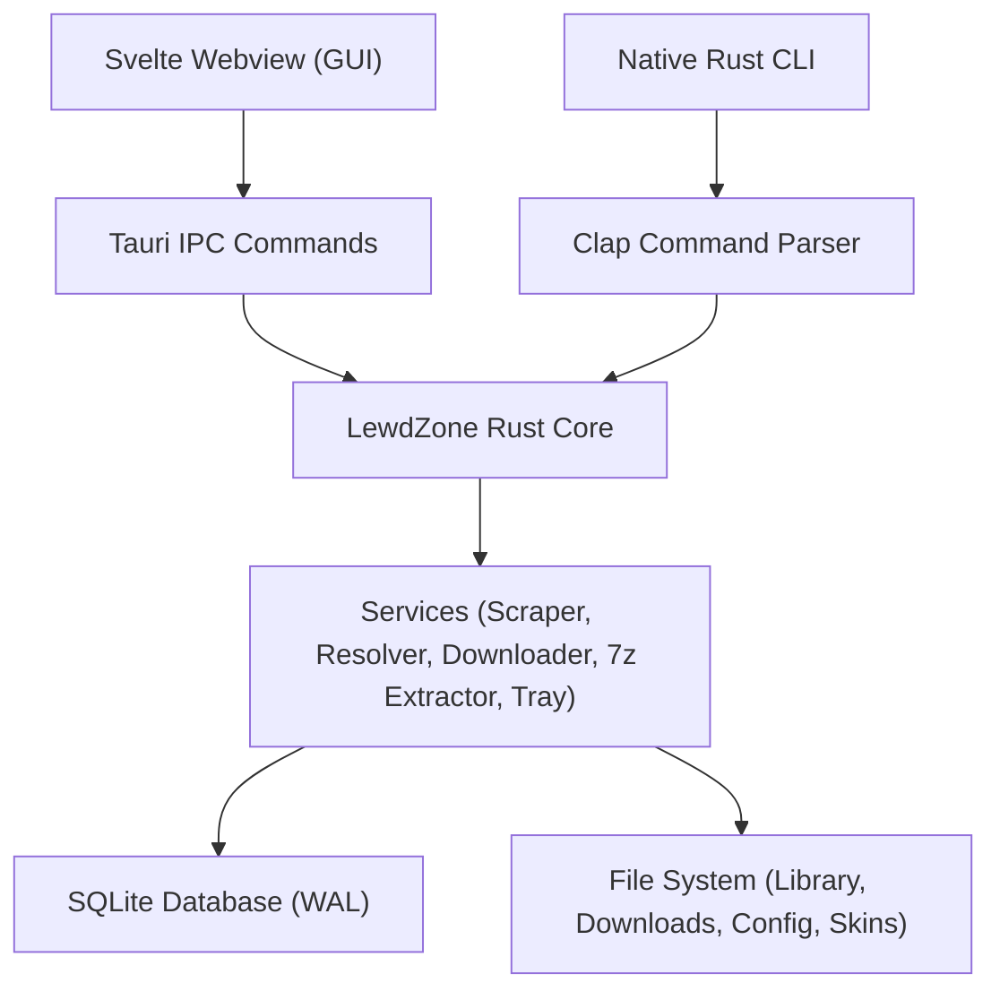
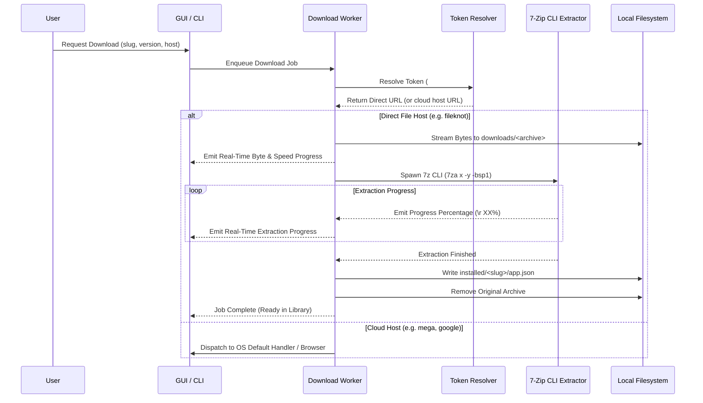

# 🏗️ Architecture

> Links between wiki pages are relative and omit the `.md` extension.

LewdZone Launcher is a **modular desktop game launcher and native CLI engine** designed around the principle of **one core, two entry points** (Rule 03, Rule 13).

---

## 🎯 Two Entry Points, One Core

The application is distributed as a single unified binary:

| Entry Point | Role | Interface |
| --- | --- | --- |
| **Tauri 2 Desktop App** | The primary user experience (Svelte frontend in `src/`, Rust host in `src-tauri/`). | Tauri IPC commands mapped directly to `core` functions. |
| **Native Rust CLI** | Full scriptable and headless engine (`src-tauri/src/cli.rs`). | Clap-based subcommands mapped directly to `core` functions with `--json` stdout output. |

Neither the GUI nor the CLI duplicates business logic: both invoke the exact same underlying Rust services and repositories.



---

## 🧱 Architectural Layers

1. **Presentation Layer (`src/`):**
   - Svelte 5 views: `Store`, `Store/[slug]`, `Library`, `Downloads`, `Favorites`, and `Settings`.
   - Dynamic CSS variable theme swap powered by the active theme's tokens.
   - Real-time progress trackers for active downloads and running extractions.
2. **IPC & CLI Dispatch Layer (`src-tauri/src/lib.rs`, `src-tauri/src/cli.rs`):**
   - Exposes `#[tauri::command]` handlers for the webview.
   - Defines and parses CLI commands and formats structured `--json` output.
3. **Core Services Layer (`src-tauri/src/core/`):**
   - `download`: Manages chunked HTTP streaming, byte counting, and download speeds.
   - `queue`: Sequential, persistent download worker with cancel and delete capabilities.
   - `extract`: Multi-format archive decompression utilizing the **7-Zip console executable** (`7za`/`7z`/`7zz`) with real-time `-bsp1` progress monitoring.
   - `folder`: Manages flat library layout (`downloads/<archive>` and `installed/<slug>/`).
   - `library`: Manifest inspection (`app.json`), game launching, and directory scanning (`games-dir`).
   - `settings`: Config JSON management, migrations, and SQLite encrypted secret storage.
   - `skins`: Runtime theme resolution and bundle validation.
4. **Data & Scraping Layer (`src-tauri/src/scraper/`, `src-tauri/src/resolver/`, `src-tauri/src/db/`):**
   - Scrapers for game cards, pagination, version tabs, and genre clouds.
   - Two-step token resolver (`start` → `reveal`) with allowlist verification.
   - SQLite migrations and repository operations with WAL mode enabled.

---

## 📂 On-Disk Storage & Folder Layout

The launcher follows a modern, user-accessible directory layout:

```text
<data_root>/lewdzone/                     # %APPDATA% / ~/.local/share / ~/Library/Application Support
├── lewdzone.db                           # SQLite database (WAL enabled, foreign keys ON)
├── config.json                           # JSON settings (secrets omitted)
├── appcache/                             # Cached catalog data and HTML
├── logs/                                 # Component logs
└── skins/                                # User theme packages
    ├── Nord/theme.json
    ├── Dracula/theme.json
    └── Material/theme.json

<library-root>/                           # Configurable via library-root setting
├── downloads/                            # Flat archive downloads (no engine folders)
│   ├── Game Title [Ongoing] - Version 0.19.1.zip
│   └── Another Game - Version 1.0.rar
└── installed/                            # Flat game installs (no engine folders)
    ├── game-slug/
    │   ├── app.json                      # itch.io-style install manifest
    │   ├── Game.exe                      # Launch executable
    │   └── game_files/
    └── another-slug/
        ├── app.json
        └── Game.exe
```

### Manifest Specifications (`app.json`)
When an archive is extracted, an itch.io-style `app.json` manifest is generated inside `<installed>/<slug>/`:
- Stores game title, version, slug, engine, and install timestamp.
- Lists detected executable candidates.
- Allows user-defined `launch_exe` override for games with custom launchers or subfolder executables.

---

## ⬇️ Download, Extraction & Verification Pipeline



---

## 🪟 In-App Sandboxed Webview Resolver

If a go-link requires countdown timers or verification, the launcher opens a dedicated, sandboxed child webview window:
- Isolated from third-party advertising, malicious popups, and click-jacking scripts.
- Presents a clean verification screen to the user.
- Emits the validated download URL back to the main launcher window upon completion.

---

## 🛎️ System Tray Integration

The desktop app integrates natively with the OS system tray:
- Displays a custom tray icon.
- Context menu: **Open LewdZone Launcher**, **Library**, **Downloads**, **Store**, **Settings**, **Check for Updates**, and **Quit LewdZone**.
- Closing or minimizing the main window automatically docks to the tray, allowing background downloads and extractions to continue uninterrupted.

---

## 🔗 Related Pages

- [Downloads & In-App Streaming](Download-Managers)
- [Archive Extraction & 7-Zip Guide](Archive-Extraction)
- [Configuration Reference](Configuration)
- [CLI Reference](CLI-Reference)
- [Security Architecture](Security)