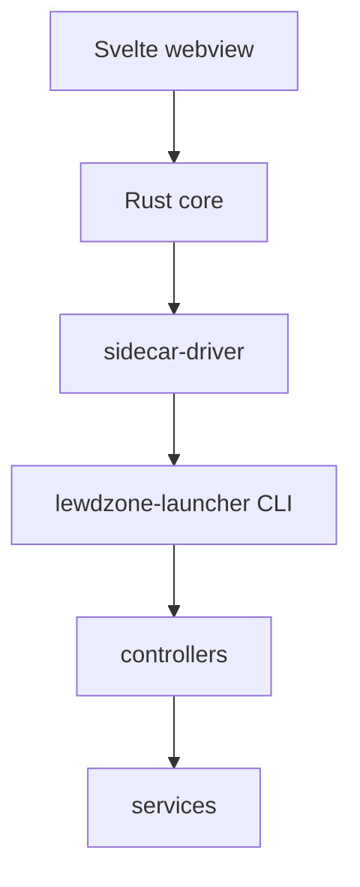

# Architecture

> Links between wiki pages are relative and omit the `.md` extension.

## Two frontends, one engine

LewdZone-Launcher is a **modular layered monolith** with two frontends:

| Frontend | Role | Talks to |
| --- | --- | --- |
| **Tauri 2 desktop app** | primary product | the CLI as a subprocess (JSON/JSONL) |
| **Python CLI** | the engine, headless/scriptable | controllers |

The app **never imports** `lewdzone_launcher`. The Rust core spawns a Python
sidecar executable and parses its stdout as machine output.

## Layer contract (inner = pure)

| Layer | Contains | May import |
| --- | --- | --- |
| `desktop/` (Tauri app) | Rust core + Svelte webview | CLI only via subprocess |
| `lewdzone_launcher/frontends/` | CLI (argparse) | controllers only |
| `lewdzone_launcher/controllers/` | game, download, sync, shortcut, artwork, content | services + domain |
| `lewdzone_launcher/domain/` | `Game`, `Version`, `DownloadEntry`, `GoToken` | stdlib only |
| `lewdzone_launcher/services/` | scraping, resolver, db, dm adapters, shortcuts, artwork, content providers | domain |
| external | lewdzone.com, FDM/IDM/torrent, sqlite, SteamGridDB/VNDB/IGDB/itch/Steam/IndieDB, native shortcuts | — |

Import rule: **inward only**. Domain never imports IO; services never import
controllers; frontends never touch services directly. Enforced with
`import-linter`. Full rule: [Rule 03](../.agents/rules/rule-03-module-architecture) —
link resolves on the wiki; in the repo it's `.agents/rules/rule-03-module-architecture.md`.

## Two-process protocol

- **Query commands** (`info`, `search`, `list`, …): one `--json` document.
- **Long-running commands** (`sync`, `download`, `shortcuts`, …): **machine
  mode**, JSONL events `{event, progress, message, ...}` with a final
  `result`.
- stdout is the protocol channel; stderr is diagnostics. Never parse stderr as
  data.
- Spawn safety: hidden console on Windows (`CREATE_NO_WINDOW`), detached POSIX
  session; never `shell=True`.

## Data model

- SQLite catalog stores go-link **tokens**, never resolved URLs (resolved URLs
  are ephemeral).
- Core tables: `game`, `genre`, `game_genre`, `version`, `download_entry`,
  `host`, `download_job`; enrichment `game_external`
  (`post_id → provider → external_id`) and `artwork_cache` (gains `provider` +
  `kind` columns).
- Config + DB live in the per-OS config dir; see [Configuration](Configuration).

## Content enrichment pipeline

Not every LewdZone page carries full metadata (indie/amateur titles are often
thin). A pluggable **content-provider layer** fills info + art gaps without
overwriting LewdZone download data:

1. `content` controller asks the provider registry for enabled providers in
   priority order (`steamgriddb, vndb, igdb, itch, steam, indiedb`).
2. Each provider searches the title; the first match maps to
   `game_external(post_id, provider, external_id)` (upsert, idempotent).
3. `fetch_info` fills only *missing* fields: description, developer, release
   date, screenshots, rating, tags, store link.
4. `fetch_asset` pulls art by kind: SteamGridDB icons/grids/heroes/logos;
   VNDB cover + screenshots; IGDB covers/artworks; itch/IndieDB page art.
5. Artwork is cached in `artwork_cache` (keyed by `(normalized_title, kind)`,
   tagged with `provider`) and used again on rebuilds (offline-fast).

APIs: SteamGridDB v2 (Bearer key), VNDB Kana (keyless), IGDB v4
(Client-ID + Twitch token), itch.io HTML scrape, Steam Storefront (keyless,
only for already-mapped appids), IndieDB HTML scrape (no public API). API keys
are pasted by the user in the app's **Settings → API keys** section and
persisted securely (Rule 10) — never echoed back. Providers degrade
gracefully: an outage or missing key means "no enrichment", never a broken
listing or download. See [Agents](Agents) for the `content` family.

## Download pipeline

1. Scraper collects `game`/`version`/`download_entry` rows from the site
   (tokens, not URLs).
2. Resolver turns a chosen token into a real URL via the site's
   `start` → `reveal` API (rate-limited).
3. **The tool never downloads files itself.** The resolved URL is handed to an
   installed download-manager adapter (FDM / IDM / torrent).
4. `folder-organizer` folds the result into
   `<DownloadRoot>/Games/<Title>/<Title> - <Version> - <Platform>[- <Variant>].<ext>`.

See [Download Managers](Download-Managers).

## Packaging

`tauri build` produces:

| Platform | Formats |
| --- | --- |
| Windows | NSIS + MSI |
| macOS | `.app` + DMG |
| Linux | AppImage + deb + rpm |

The Python CLI ships as a PyInstaller `externalBin` sidecar bundled in the app.

## Cross-platform rules

- Config dirs: `%APPDATA%` (Windows), `~/.config` or `$XDG_CONFIG_HOME` (Linux),
  `~/Library/Application Support` (macOS).
- Spawn flags: `CREATE_NO_WINDOW` (Windows) vs detached POSIX session.
- Shortcuts: `.lnk` (win32com), `.desktop` (xdg), `.app`/aliases (macOS).
- All paths via `pathlib`; no hardcoded separators.