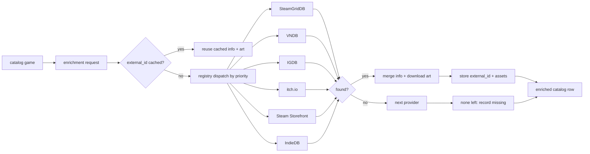

# 🪄 Content Providers

> Links between wiki pages are relative and omit the `.md` extension.

Not every LewdZone page carries complete metadata — indie and amateur titles
often lack descriptions, screenshots, release dates, and artwork. A pluggable
**content-provider layer** enriches the catalog with external info and art,
while keeping LewdZone as the source of truth for downloadability (versions,
platforms, hosts).

## 🧭 Principle

- LewdZone data is authoritative for **downloads**.
- Provider data is authoritative for **presentation** (info + art).
- Providers only fill *missing* fields — they never overwrite a scraped value.

## 🗂️ Providers

| Provider | name | Info | Art | API key | Notes |
| --- | --- | --- | --- | --- | --- |
| SteamGridDB | `steamgriddb` | no | icons, grids, heroes, logos | Bearer key | `nsfw=yes` for mature titles |
| VNDB (Kana) | `vndb` | description, developer, rating, tags, screenshots | cover + screenshots | none | Best adult-VN coverage |
| IGDB v4 | `igdb` | description, genres, screenshots | covers / artworks | Twitch Client-ID + secret | mainstream + mid-size |
| itch.io | `itch` | description, dev, price, platforms | cover, screenshots | optional | indie hub, HTML scrape |
| Steam Storefront | `steam` | description, screenshots | capsule/header | none | only for known Steam appids |
| IndieDB | `indiedb` | description, images | images | none | no public API, HTML scrape |

## 🔀 How it works

- `game_external` DB table maps `post_id → provider → external_id` (idempotent
  upsert).
- `artwork_cache` is keyed by `(normalized_title, kind)` and tagged with
  `provider` + `kind`, so a game can hold a SteamGridDB icon and a VNDB cover
  simultaneously, and rebuilds are offline-fast.

## 🔑 API keys & settings

Keys are set from the app's **Settings → API keys** section or CLI:

| Setting | Provider | Secret |
| --- | --- | --- |
| `sgdb-api-key` | steamgriddb | yes |
| `igdb-client-id` | igdb | yes |
| `igdb-client-secret` | igdb | yes |
| `content-providers-enabled` | which providers are on | no |
| `content-priority` | dispatch order | no |

Keys live in the per-OS config dir (Rule 10). Providers that are disabled or
missing a key simply don't enrich — downloads are never affected. See
[Configuration](Configuration) for the full settings list.

## 🛡️ Robustness

- Missing key / provider outage → "no enrichment", never a hard failure.
- Enrichment is idempotent; re-running never duplicates rows.
- All provider calls follow [Network Etiquette](Design-Conventions) (1 req/s,
  retries, offline fixtures); live tests are opt-in (`cargo test -- --ignored`).

## 🧑‍🔬 Agent ownership

The `content` agent family owns this layer —
[Agent Ecosystem](Agents): provider-registry, steamgriddb-provider,
vndb-provider, igdb-provider, itch-provider, steam-provider, indiedb-provider.
The `shortcuts` family's `artwork-fetch` consumes provider art for native
shortcuts instead of talking to a single source.