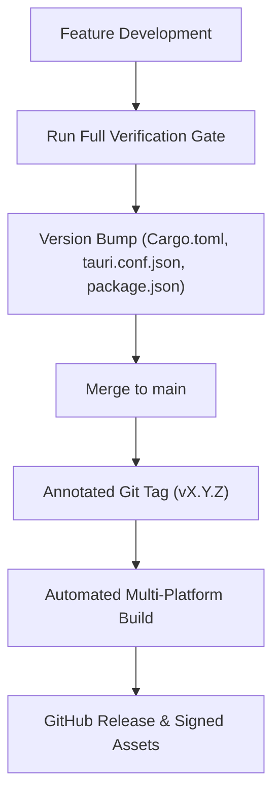

# 🚀 Release Process & Versioning Standards

> Links between wiki pages are relative and omit the `.md` extension.

LewdZone Launcher follows strict **Semantic Versioning (`MAJOR.MINOR.PATCH`)** standards. Because the application exposes both a GUI and an integrated CLI from a single binary, release versions are strictly synchronized across all descriptors (Rule 08, Rule 13).

---

## 🔖 Single Source of Truth

The release version is synchronized across all project files:
- `src-tauri/Cargo.toml` (`version = "x.y.z"`)
- `src-tauri/tauri.conf.json` (`"version": "x.y.z"`)
- `package.json` (`"version": "x.y.z"`)

Running `lewdzone --version` outputs the exact same version string compiled into the desktop application window.

---

## 🔄 Release Pipeline



---

## ✅ Pre-Release Verification Gate

Before cutting any release or creating an annotated git tag, the entire verification pipeline must pass without errors or warnings:

```bash
# 1. Rust checks (from src-tauri/)
cargo fmt --check
cargo clippy -- -D warnings
cargo check
cargo test

# 2. Frontend checks (from repo root)
npm run check
npm run test

# 3. Build smoke test
npm run tauri build

# 4. CLI smoke test
lewdzone --version
lewdzone --help
```

---

## 📦 Distribution Packages

Each official release publishes signed, standalone platform artifacts:

- **Windows:** NSIS executable installer (`.exe`) and Windows Installer package (`.msi`).
- **macOS:** Universal `.app` bundle and Apple Disk Image (`.dmg`) for Apple Silicon and Intel.
- **Linux:** Portable AppImage (`.AppImage`), Debian package (`.deb`), and Red Hat package (`.rpm`).

No secondary CLI sidecar packages are distributed: the CLI is built directly into the launcher executable.

---

## 🔗 Related Pages

- [Installing & Building](Installing-and-Building)
- [Testing & QA](Testing)
- [Architecture](Architecture)
- [Governance & Agents](Agents)