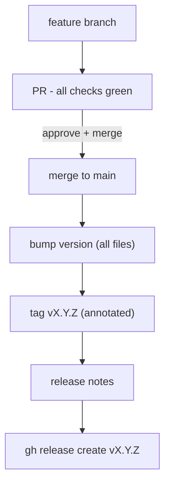

# Release Process

> Links between wiki pages are relative and omit the `.md` extension.

## Versioning

SemVer `MAJOR.MINOR.PATCH`. The version is synced across:

- `src-tauri/Cargo.toml` (crate `version` + `tauri.conf.json`)
- `package.json`

There is a single binary; the CLI reports the same version as the app
(`lewdzone --version`).

## Release flow

## Verification gate (before tag)

Everything must be green first:

- `cargo fmt --check` + `cargo clippy -- -D warnings` + `cargo test` (from `src-tauri/`)
- `npm run check` (svelte-check) + `npm run test` (Vitest)
- Coverage ≥ floors (`cargo llvm-cov`)
- `lewdzone --version` smoke test
- `tauri build` succeeds on all target platforms (CI)

## Release notes structure

`gh release create vX.Y.Z --title "vX.Y.Z — <Key Feature>" --notes-file <file>`

Sections:

- ✨ **Highlights**
- 🚀 **Key Improvements & Features**
- 🛡️ **Security & Governance**
- 📄 **Changes & Commits**
- 📦 **Quick Start & Upgrading**

Pre-releases use `vX.Y.Z-alpha.N` / `vX.Y.Z-beta.N` with `gh release create --prerelease`.

Tags are annotated and never deleted. Full rule: [Rule 08](https://github.com/helix-origin/lewdzone-launcher/tree/main/.agents/rules/rule-08-release-standards.md).