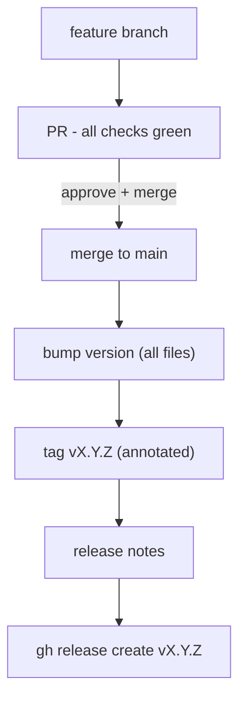

# Release Process

> Links between wiki pages are relative and omit the `.md` extension.

## Versioning

SemVer `MAJOR.MINOR.PATCH`. The version is synced across:

- `desktop/src-tauri/Cargo.toml` + `tauri.conf.json`
- `desktop/package.json`
- `src/lewdzone_launcher/__init__.py` (`__version__`)
- `pyproject.toml`

**Sidecar version must equal app version** (verified at app startup).

## Release flow

## Verification gate (before tag)

Everything must be green first:

- `ruff check .` + `ruff format --check .`
- `pyright`
- `pytest -q` (offline suite) + coverage ≥ floors
- `bandit -r src/` + `pip-audit`
- `lewdzone-launcher --version` smoke test
- Desktop: `tauri build` succeeds on all target platforms (CI)

## Release notes structure

`gh release create vX.Y.Z --title "vX.Y.Z — <Key Feature>" --notes-file <file>`

Sections:

- ✨ **Highlights**
- 🚀 **Key Improvements & Features**
- 🛡️ **Security & Governance**
- 📄 **Changes & Commits**
- 📦 **Quick Start & Upgrading**

Pre-releases use `vX.Y.Z-alpha.N` / `vX.Y.Z-beta.N` with `gh release create --prerelease`.

Tags are annotated and never deleted. Full rule: [Rule 08](../.agents/rules/rule-08-release-standards).